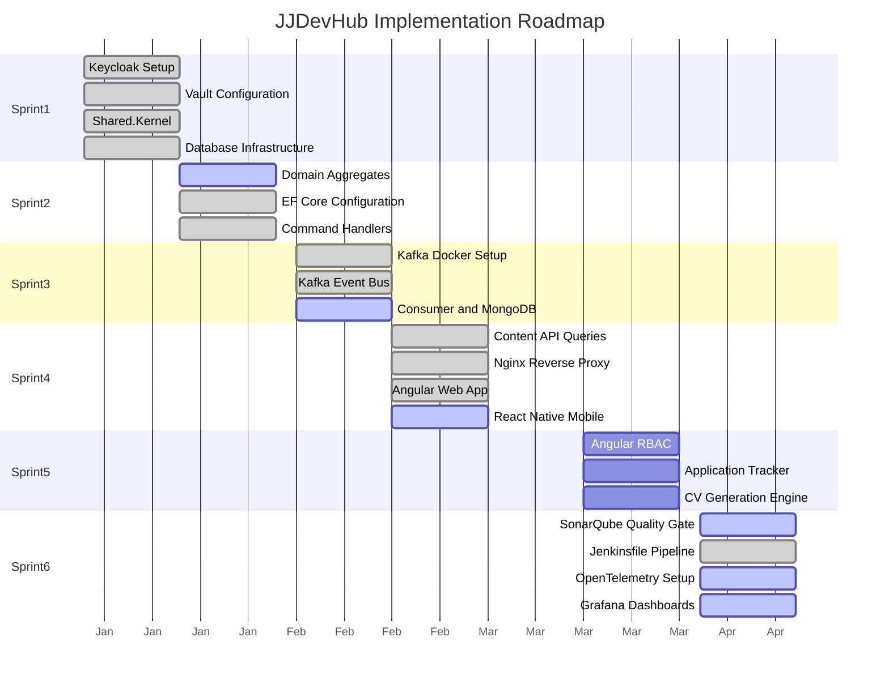

# JJDevHub - Backlog & Roadmap

> Zunifikowany backlog projektu JJDevHub. Kazdy sprint buduje na poprzednim, bez luk.

## Legenda statusow

| Status | Znaczenie |
|--------|-----------|
| `DONE` | Zadanie w pelni zaimplementowane i przetestowane |
| `IN PROGRESS` | Czesciowo zaimplementowane, wymaga dokonczenia |
| `TODO` | Nie rozpoczete |

## Roadmapa sprintow

## Przeglad sprintow

### Sprint 1: Identity & Foundation (Straznik i Bazy)

**Cel:** Postawienie infrastruktury oraz zablokowanie dostepu do systemu.

| Task | Nazwa | Status | Plik |
|------|-------|--------|------|
| 1.1 | [Keycloak Setup](sprint-1/task-1.1-keycloak-setup.md) | DONE | Keycloak w compose, realm import, JWT + OwnerOnly w Content.Api |
| 1.2 | [Vault Configuration](sprint-1/task-1.2-vault-configuration.md) | DONE | VaultSharp.Extensions.Configuration, health Vault, bootstrap flat keys |
| 1.3 | [Shared.Kernel](sprint-1/task-1.3-shared-kernel.md) | DONE | Pelny zestaw DDD building blocks |
| 1.4 | [Database Infrastructure](sprint-1/task-1.4-database-infrastructure.md) | DONE | PostgreSQL + MongoDB w docker-compose |

### Sprint 2: The Core & Write Side (Zapis i Reguly)

**Cel:** Obsluga logiki biznesowej i zapisu (Command).

| Task | Nazwa | Status | Plik |
|------|-------|--------|------|
| 2.1 | [Domain Aggregates](sprint-2/task-2.1-domain-aggregates.md) | DONE | WorkExperience + CurriculumVitae, testy, EF, API |
| 2.2 | [EF Core Configuration](sprint-2/task-2.2-ef-core-configuration.md) | DONE | Fluent API + DateRange mapping |
| 2.3 | [Command Handlers](sprint-2/task-2.3-command-handlers.md) | DONE | MediatR + FluentValidation |

### Sprint 3: Event-Driven Sync (Rozproszenie Danych)

**Cel:** Synchronizacja zapisu z odczytem bez spowalniania API.

| Task | Nazwa | Status | Plik |
|------|-------|--------|------|
| 3.1 | [Kafka Docker Setup](sprint-3/task-3.1-kafka-docker-setup.md) | DONE | Kafka + Zookeeper w docker-compose |
| 3.2 | [Kafka Event Bus](sprint-3/task-3.2-kafka-event-bus.md) | DONE | Producer z idempotencja |
| 3.3 | [Kafka Consumer + MongoDB](sprint-3/task-3.3-kafka-consumer-mongodb.md) | DONE | KafkaConsumerService, DLT, retry, health |

### Sprint 4: Public Face & Mobile (Dla Studentow)

**Cel:** Frontend publiczny oraz prezentacja danych.

| Task | Nazwa | Status | Plik |
|------|-------|--------|------|
| 4.1 | [Content API Queries](sprint-4/task-4.1-content-api-queries.md) | DONE | Content API v1, CV/WE, caching, rate limit, Swagger |
| 4.2 | [Nginx Reverse Proxy](sprint-4/task-4.2-nginx-reverse-proxy.md) | DONE | Routing do wszystkich serwisow |
| 4.3 | [Angular Web App](sprint-4/task-4.3-angular-web-app.md) | DONE | Blog mock, Admin WE, Keycloak-ready, Material |
| 4.4 | [React Native Mobile](sprint-4/task-4.4-react-native-mobile.md) | DONE | Blog stack, mock, pull-to-refresh, AsyncStorage cache |

### Sprint 5: The Secret Feature (Narzedzie dla Ciebie)

**Cel:** Ukryty modul zarzadzania kariera.

| Task | Nazwa | Status | Plik |
|------|-------|--------|------|
| 5.1 | [Angular RBAC](sprint-5/task-5.1-angular-rbac.md) | DONE | isOwner, Owner guard, silent SSO, admin/cv + admin/tracker |
| 5.2 | [Application Tracker](sprint-5/task-5.2-application-tracker.md) | IN PROGRESS | Placeholder UI — pelny bounded context w kolejnych iteracjach |
| 5.3 | [CV Generation Engine](sprint-5/task-5.3-cv-generation-engine.md) | IN PROGRESS | Placeholder UI — QuestPDF/API w kolejnych iteracjach |

### Sprint 6: Observability & DevOps (Jakosc)

**Cel:** Utrzymanie i monitoring na poziomie Enterprise.

| Task | Nazwa | Status | Plik |
|------|-------|--------|------|
| 6.1 | [SonarQube Quality Gate](sprint-6/task-6.1-sonarqube-quality-gate.md) | IN PROGRESS | sonar-project.properties; Quality Gate w UI SonarQube |
| 6.2 | [Jenkinsfile Pipeline](sprint-6/task-6.2-jenkinsfile-pipeline.md) | DONE | Pelny 9-stage pipeline |
| 6.3 | [OpenTelemetry Setup](sprint-6/task-6.3-opentelemetry-setup.md) | IN PROGRESS | Content.Api ma Prometheus metrics |
| 6.4 | [Grafana Dashboards](sprint-6/task-6.4-grafana-dashboards.md) | IN PROGRESS | content-api + infrastructure-overview.json |
| 6.5 | [Ekstrakcja NuGet Packages](sprint-6/task-6.5-extract-nuget-packages.md) | TODO | Plan: [packages-extraction-plan.md](packages-extraction-plan.md) |

## Dodatkowe dokumenty

- [NuGet Reference](nuget-reference.md) - Pelne zestawienie pakietow NuGet
- [Hosting & Cloudflare](hosting-cloudflare.md) - Architektura VPS + Cloudflare
- [Plan ekstrakcji pakietow NuGet](packages-extraction-plan.md) — Task 6.5

## Podsumowanie statusow

| Status | Liczba taskow |
|--------|---------------|
| DONE | 16 |
| IN PROGRESS | 5 |
| TODO | 1 |
| **Razem** | **22** |

Uwaga: Task **6.5** pozostaje **TODO** (ekstrakcja kodu); dostepny jest plan w [packages-extraction-plan.md](packages-extraction-plan.md).
