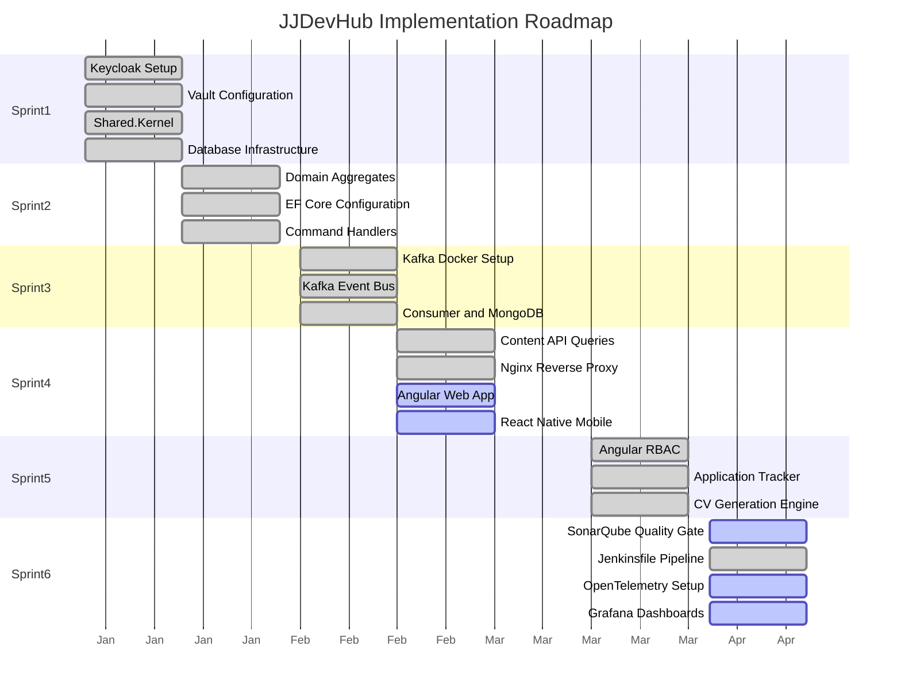

# JJDevHub - Backlog & Roadmap

> Zunifikowany backlog projektu JJDevHub. Kazdy sprint buduje na poprzednim, bez luk.
>
> Status w tabelach ponizej odzwierciedla **kod** (stan na 2026-08), nie historyczne check-boxy w plikach taskow.

## Legenda statusow

| Status | Znaczenie |
|--------|-----------|
| `DONE` | Zadanie w pelni zaimplementowane i przetestowane (MVP sprintu) |
| `IN PROGRESS` | Czesciowo zaimplementowane, wymaga dokonczenia |
| `TODO` | Nie rozpoczete |

## Roadmapa sprintow

```mermaid
gantt
    title JJDevHub Implementation Roadmap
    dateFormat YYYY-MM-DD
    axisFormat %b

    section Sprint1
    Keycloak Setup           :done, s1t1, 2026-01-01, 14d
    Vault Configuration      :done, s1t2, 2026-01-01, 14d
    Shared.Kernel            :done, s1t3, 2026-01-01, 14d
    Database Infrastructure  :done, s1t4, 2026-01-01, 14d

    section Sprint2
    Domain Aggregates        :done, s2t1, 2026-01-15, 14d
    EF Core Configuration    :done, s2t2, 2026-01-15, 14d
    Command Handlers         :done, s2t3, 2026-01-15, 14d

    section Sprint3
    Kafka Docker Setup       :done, s3t1, 2026-02-01, 14d
    Kafka Event Bus          :done, s3t2, 2026-02-01, 14d
    Consumer and MongoDB     :done, s3t3, 2026-02-01, 14d

    section Sprint4
    Content API Queries      :done, s4t1, 2026-02-15, 14d
    Nginx Reverse Proxy      :done, s4t2, 2026-02-15, 14d
    Angular Web App          :active, s4t3, 2026-02-15, 14d
    React Native Mobile      :active, s4t4, 2026-02-15, 14d

    section Sprint5
    Angular RBAC             :done, s5t1, 2026-03-15, 14d
    Application Tracker      :done, s5t2, 2026-03-15, 14d
    CV Generation Engine     :done, s5t3, 2026-03-15, 14d

    section Sprint6
    SonarQube Quality Gate   :active, s6t1, 2026-04-01, 14d
    Jenkinsfile Pipeline     :done, s6t2, 2026-04-01, 14d
    OpenTelemetry Setup      :active, s6t3, 2026-04-01, 14d
    Grafana Dashboards       :active, s6t4, 2026-04-01, 14d
```

## Przeglad sprintow

### Sprint 1: Identity & Foundation (Straznik i Bazy)

**Cel:** Postawienie infrastruktury oraz zablokowanie dostepu do systemu.

| Task | Nazwa | Status | Plik |
|------|-------|--------|------|
| 1.1 | [Keycloak Setup](sprint-1/task-1.1-keycloak-setup.md) | DONE | Keycloak w compose, realm import, seed Owner/Student, JWT + OwnerOnly w Content.Api |
| 1.2 | [Vault Configuration](sprint-1/task-1.2-vault-configuration.md) | DONE | VaultSharp w Content.Api; `Vault__Enabled=false` w compose (fallback env/appsettings) |
| 1.3 | [Shared.Kernel](sprint-1/task-1.3-shared-kernel.md) | DONE | Pelny zestaw DDD building blocks |
| 1.4 | [Database Infrastructure](sprint-1/task-1.4-database-infrastructure.md) | DONE | PostgreSQL + MongoDB w docker-compose; Mongo auth w prod overlay |

### Sprint 2: The Core & Write Side (Zapis i Reguly)

**Cel:** Obsluga logiki biznesowej i zapisu (Command).

| Task | Nazwa | Status | Plik |
|------|-------|--------|------|
| 2.1 | [Domain Aggregates](sprint-2/task-2.1-domain-aggregates.md) | DONE | WorkExperience + CurriculumVitae, testy, EF, API |
| 2.2 | [EF Core Configuration](sprint-2/task-2.2-ef-core-configuration.md) | DONE | Fluent API + DateRange mapping |
| 2.3 | [Command Handlers](sprint-2/task-2.3-command-handlers.md) | DONE | MediatR + FluentValidation + transactional outbox |

### Sprint 3: Event-Driven Sync (Rozproszenie Danych)

**Cel:** Synchronizacja zapisu z odczytem bez spowalniania API.

| Task | Nazwa | Status | Plik |
|------|-------|--------|------|
| 3.1 | [Kafka Docker Setup](sprint-3/task-3.1-kafka-docker-setup.md) | DONE | Kafka + Zookeeper w docker-compose |
| 3.2 | [Kafka Event Bus](sprint-3/task-3.2-kafka-event-bus.md) | DONE | Producer z idempotencja + OutboxPublisherHostedService |
| 3.3 | [Kafka Consumer + MongoDB](sprint-3/task-3.3-kafka-consumer-mongodb.md) | DONE | KafkaConsumerService: WE, JobApplication, CurriculumVitae; DLT, retry, health |

### Sprint 4: Public Face & Mobile (Dla Studentow)

**Cel:** Frontend publiczny oraz prezentacja danych.

| Task | Nazwa | Status | Plik |
|------|-------|--------|------|
| 4.1 | [Content API Queries](sprint-4/task-4.1-content-api-queries.md) | DONE | Content API v1, CV/WE, caching, rate limit, Swagger |
| 4.2 | [Nginx Reverse Proxy](sprint-4/task-4.2-nginx-reverse-proxy.md) | DONE | Routing do wszystkich serwisow |
| 4.3 | [Angular Web App](sprint-4/task-4.3-angular-web-app.md) | IN PROGRESS | SPA + Material + admin; **blog nadal mock** (brak endpointow Content API) |
| 4.4 | [React Native Mobile](sprint-4/task-4.4-react-native-mobile.md) | IN PROGRESS | WE z API, blog mock, pull-to-refresh, AsyncStorage; brak Keycloak/admin |

### Sprint 5: The Secret Feature (Narzedzie dla Ciebie)

**Cel:** Ukryty modul zarzadzania kariera.

| Task | Nazwa | Status | Plik |
|------|-------|--------|------|
| 5.1 | [Angular RBAC](sprint-5/task-5.1-angular-rbac.md) | DONE | isOwner, Owner guard, silent SSO, admin/cv + admin/tracker |
| 5.2 | [Application Tracker](sprint-5/task-5.2-application-tracker.md) | DONE | JobApplication API + Angular CRUD + requirements/notes/interview stages |
| 5.3 | [CV Generation Engine](sprint-5/task-5.3-cv-generation-engine.md) | DONE | QuestPDF (profil, WE, skills, education, projects), blob Mongo, admin-cv CRUD |

### Sprint 6: Observability & DevOps (Jakosc)

**Cel:** Utrzymanie i monitoring na poziomie Enterprise.

| Task | Nazwa | Status | Plik |
|------|-------|--------|------|
| 6.1 | [SonarQube Quality Gate](sprint-6/task-6.1-sonarqube-quality-gate.md) | IN PROGRESS | Compose + scanner + waitForQualityGate; brak custom QG 80% / webhook / token w Vault |
| 6.2 | [Jenkinsfile Pipeline](sprint-6/task-6.2-jenkinsfile-pipeline.md) | DONE | Pelny 9-stage pipeline (`docker compose`; prod overlay recznie) |
| 6.3 | [OpenTelemetry Setup](sprint-6/task-6.3-opentelemetry-setup.md) | IN PROGRESS | Content.Api: Prometheus + OTLP/Jaeger + HttpClient; brak OTEL na stubach |
| 6.4 | [Grafana Dashboards](sprint-6/task-6.4-grafana-dashboards.md) | IN PROGRESS | content-api + infra overview; brak exporterow PG/Mongo/Kafka i business metrics |
| 6.5 | [Ekstrakcja NuGet Packages](sprint-6/task-6.5-extract-nuget-packages.md) | TODO | Plan: [packages-extraction-plan.md](packages-extraction-plan.md) |

## Dodatkowe dokumenty

- [NuGet Reference](nuget-reference.md) - Pelne zestawienie pakietow NuGet
- [Hosting & Cloudflare](hosting-cloudflare.md) - Architektura VPS + Cloudflare
- [Plan ekstrakcji pakietow NuGet](packages-extraction-plan.md) — Task 6.5
- [Transactional Outbox](transactional-outbox-kafka.md) — Kafka decoupling (Mongo upsert nadal pre-commit)

## Podsumowanie statusow

| Status | Liczba taskow |
|--------|---------------|
| DONE | 16 |
| IN PROGRESS | 5 |
| TODO | 1 |
| **Razem** | **22** |

### Pozostaly dlug (poza 6.5)

- Blog: brak domeny/API — Angular i mobile uzywaja mockow (4.3 / 4.4).
- Identity / Analytics / AI Gateway / Notification / Education — stub `/health`.
- Vault wlacza sie tylko przy `Vault__Enabled=true` (domyslnie wylaczony).
- Jenkins stage Deploy wdraza **dev** compose; produkcja: `docker compose -f docker-compose.yml -f docker-compose.prod.yml up -d`.
- VPS / Cloudflare checklist w [hosting-cloudflare.md](hosting-cloudflare.md) nie jest zamknieta (registry + SSH).
- Istniejace wolumeny Mongo bez auth **nie** dostana uzytkownika z `MONGO_INITDB_*` — trzeba je zrekreowac.

## Dokumentacja

- [Przewodnik kompleksowy (PL)](../jjdevhub-przewodnik-kompleksowy.md) — mapa systemu, E2E, playbook, tutoriale technologii, FAQ
- [Architecture Tutorial (EN)](../architecture-tutorial.md) — pelny tutorial DDD/CQRS/Clean Architecture
