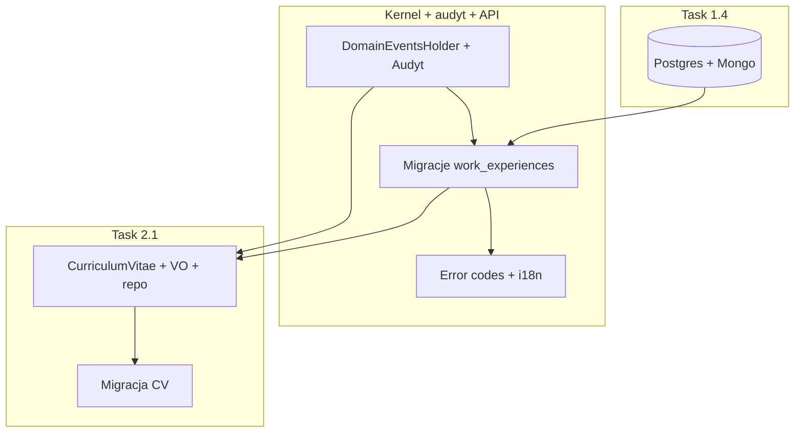

# Plan scalony: Kernel + audyt + i18n + infrastruktura DB + agregaty (1.4 / 2.1)

Dokument łączy upgrade architektury (audyt, domain events, kody błędów, i18n) z backlogiem **[task-1.4-database-infrastructure](sprint-1/task-1.4-database-infrastructure.md)** oraz **[task-2.1-domain-aggregates](sprint-2/task-2.1-domain-aggregates.md)**.

---

## A. Task 1.4 — infrastruktura bazodanowa (kontekst i zależności)

**Status backlogu:** DONE — PostgreSQL i MongoDB w [infra/docker/docker-compose.yml](../../infra/docker/docker-compose.yml).

| Element | Wartość (dev) |
|---------|----------------|
| PostgreSQL 16 | host `5433`, baza `jjdevhub_content`, user `jjdevhub` |
| MongoDB | host `27018`, baza read `jjdevhub_content_read` |
| Health | Content.Api `/health` — Npgsql + MongoDB |

**Rola w tym planie:**

- Każda **migracja EF** (nowe kolumny audytu, `RowVersion`, później tabela `curriculum_vitae`) musi być stosowana względem **tego** PostgreSQL (lub analogicznego connection stringa z Vault).
- Przed wdrożeniem zmian schematu: upewnij się, że `docker compose up` dla `db` jest zgodny z dokumentacją 1.4; na produkcji connection stringi z Vault (task 1.2).
- **Uzupełnienie vs sam plan audytu:** task 1.4 wspomina brak auth MongoDB na dev — na produkcji dodać `MONGO_INITDB_ROOT_*`; warto mieć to w tej samej checklistie wdrożeniowej co migracje.

**Kolejność:** Infrastruktura 1.4 jest **fundamentem** — migracje z Fazy 2 (poniżej) zakładają działający Postgres.

---

## B. Upgrade Kernel + Persistence + API + front (rdzeń wcześniejszego planu)

### B1. Shared.Kernel

- **`DomainEventsHolder`** — jedna implementacja listy zdarzeń; `AggregateRoot` i `AuditableAggregateRoot` tylko delegują.
- **`AuditableEntity`:** `CreatedById`, `ModifiedById`, pole współbieżności (`long`/`byte[]` + strategia PostgreSQL zgodna z EF).
- Opcjonalnie:** `DomainException` z `Code` dla i18n.

### B2. Persistence (Content)

- `ICurrentUser` + `ApplyAuditInfo` bez refleksji; migracja kolumn; `DbUpdateConcurrencyException` → 409 + kod.
- Konfiguracja EF dla nowych pól na istniejących encjach (`WorkExperience`).

### B3. API + Angular (i18n)

- `ErrorResponse` z `code`; FluentValidation `WithErrorCode`; klienci tłumaczą po kodzie.

---

## C. Task 2.1 — agregaty domenowe (CurriculumVitae) w ramach tego samego planu

**Stan:** `WorkExperience` DONE; **TODO:** agregat `CurriculumVitae` + VO + repozytorium + testy (wg [task-2.1](sprint-2/task-2.1-domain-aggregates.md)).

### C1. Zależność od upgrade’u Kernel

- `CurriculumVitae` ma dziedziczyć **`AuditableAggregateRoot`** **po** wdrożeniu holdera zdarzeń i rozszerzonego audytu — wtedy od razu dostaje spójne `CreatedById` / `ModifiedById` / wersję jak `WorkExperience` (po migracji także dla CV).
- Encje potomne (`Skill`, `Education`, `Project`) jako `Entity` (bez własnego audytu na poziomie wiersza) lub zgodnie z decyzją: często tylko root jest audytowany.

### C2. Implementacja (skrót z task 2.1)

1. Value Objects: `PersonalInfo`, `SkillLevel` (enum), `EducationDegree` (enum).
2. Encje potomne: `Skill`, `Education`, `Project` (reguły w agregacie).
3. Agregat `CurriculumVitae`: kolekcje, `List<Guid> WorkExperienceIds`, fabryka `Create(personalInfo)`, metody `AddSkill`, `RemoveSkill`, `AddEducation`, `AddProject`, `LinkWorkExperience`, domain events (Created, Updated, SkillAdded, …).
4. `ICurriculumVitaeRepository` w Core; implementacja EF w Persistence (**Task 2.2** — osobna migracja tabeli `curriculum_vitae` + owned/kolekcje).
5. Testy jednostkowe analogiczne do WorkExperience.

### C3. Baza i 1.4

- Nowa tabela(y) w **PostgreSQL** (write model); read model MongoDB może być uzupełniony w **Task 3.3** — plan scalony zakłada: najpierw Postgres + domena, potem projekcja do Mongo jeśli potrzebna na UI.

### C4. i18n a CV

- Walidacja domenowa (`PersonalInfo`, długości pól) → **kody błędów** (`CV.EMAIL_INVALID`, …), nie sztywne stringi PL/EN z API.
- **Treści użytkownika** (bio, nazwy projektów) — nadal jednojęzyczne w pierwszej iteracji; wielojęzyczne opisy = osobny rozszerzony backlog (tłumaczenia encji).

---

## D. Harmonogram (scalone fazy)

| Faza | Zakres | Powiązanie backlogu |
|------|--------|---------------------|
| **0** | Docker Postgres/Mongo wg 1.4 (już jest) | 1.4 |
| **1** | Kernel: `DomainEventsHolder` + rozszerzony `AuditableEntity` + opcjonalnie `DomainException.Code` | — |
| **2** | Migracja `work_experiences` + `ApplyAuditInfo` + `ICurrentUser` + 409 | 1.4 + persistence |
| **3** | API kody błędów + Angular i18n | — |
| **4** | **CurriculumVitae** (Core + VO + events + `ICurriculumVitaeRepository`) | **2.1** |
| **5** | EF migracja + konfiguracja CV + testy | 2.1 + **2.2** (rozszerzenie) |

Fazy 4–5 mogą częściowo nakładać się z Fazą 3 (różne osoby / równolegle), o ile Faza 1 jest w gałęzi przed pierwszym merge CV.

---

## G. Stan wdrożenia (2026-03)

Wykonane w kodzie:

- **Kernel:** `DomainEventsHolder`, audyt (`CreatedById`, `ModifiedById`, `Version` + `ApplyPersistenceOnCreate/Modify`), `DomainException.Code`, `InternalsVisibleTo` Persistence.
- **Persistence:** `ICurrentUser` / `HttpContextCurrentUser`, migracja schematu przez EF Core migrations (`dotnet ef database update`), kolumny `row_version`, audyt; optymistyczna współbieżność przy UPDATE.
- **API:** `ErrorResponse` z `code`, walidacja z `ErrorCode`, PUT z `version`, 409 przy konflikcie; Mongo `GuidSerializer(Standard)`.
- **Angular:** model zgodny z DTO, `api-error-messages` (PL/EN), PUT wymaga `version`.
- **CV (rdzeń 2.1):** agregat `CurriculumVitae`, VO `PersonalInfo`, encje `CvSkill`/`CvEducation`/`CvProject`, enumy, `ICurriculumVitaeRepository` — **bez** jeszcze EF/handlers API (task 2.2+).

---

## E. Checklisty akceptacji (zbiorcze)

**1.4 (regresja / wdrożenie):**

- [ ] Compose: Postgres 5433, Mongo 27018, sieć, wolumeny
- [ ] Content.Api health obu baz OK po zmianach

**Upgrade audytu / i18n:**

- [ ] Brak zduplikowanej logiki domain events w dwóch klasach bazowych
- [ ] Kolumny audytu + współbieżność na encjach audytowanych
- [ ] Odpowiedzi błędów z `code`; front mapuje tłumaczenia

**2.1 (CurriculumVitae):**

- [ ] Agregat + VO + events + `ICurriculumVitaeRepository`
- [ ] Testy jednostkowe
- [ ] Tabela(y) w Postgres (Faza 5 / task 2.2)

---

## F. Odniesienia do plików backlogu

- [task-1.4-database-infrastructure.md](sprint-1/task-1.4-database-infrastructure.md)
- [task-2.1-domain-aggregates.md](sprint-2/task-2.1-domain-aggregates.md)
