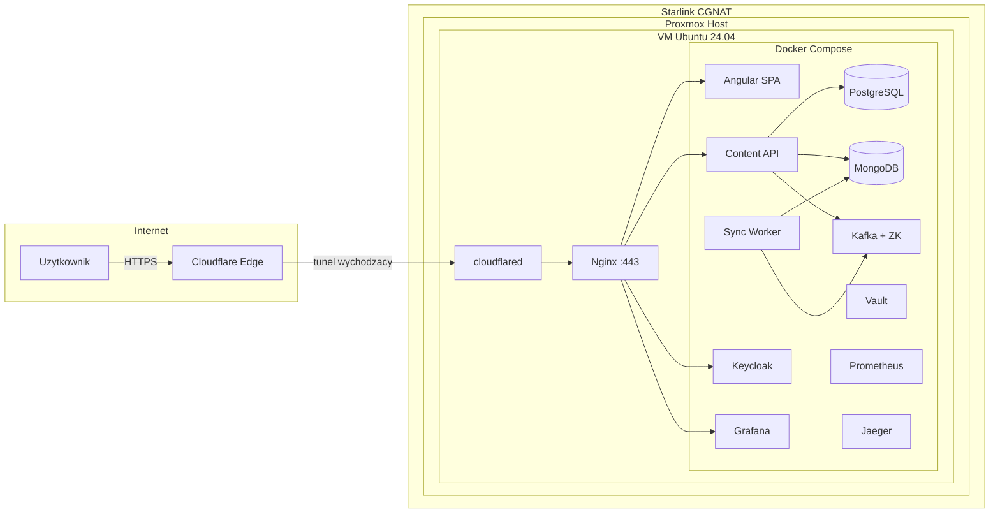

# JJDevHub — Deployment: Proxmox + Starlink + Cloudflare Tunnel

> Kompletna instrukcja wdrozenia JJDevHub na wlasnym serwerze (Proxmox) za Starlink Residential, z uzyciem Cloudflare Tunnel do ekspozycji na internet.

---

## Spis tresci

1. [Przeglad architektury](#1-przeglad-architektury)
2. [Wymagania](#2-wymagania)
3. [Krok 1 — VM na Proxmox](#3-krok-1--vm-na-proxmox)
4. [Krok 2 — Instalacja Docker i narzedzi](#4-krok-2--instalacja-docker-i-narzedzi)
5. [Krok 3 — Cloudflare Tunnel](#5-krok-3--cloudflare-tunnel)
6. [Krok 4 — SSL (Cloudflare Origin CA)](#6-krok-4--ssl-cloudflare-origin-ca)
7. [Krok 5 — Konfiguracja produkcyjna](#7-krok-5--konfiguracja-produkcyjna)
8. [Krok 6 — Pierwsze uruchomienie](#8-krok-6--pierwsze-uruchomienie)
9. [Krok 7 — Backup i monitoring](#9-krok-7--backup-i-monitoring)
10. [Krok 8 — Cloudflare Access (ochrona paneli)](#10-krok-8--cloudflare-access-ochrona-paneli)
11. [Aspekty specyficzne dla Starlink](#11-aspekty-specyficzne-dla-starlink)
12. [Aktualizacje i utrzymanie](#12-aktualizacje-i-utrzymanie)
13. [Troubleshooting](#13-troubleshooting)

---

## 1. Przeglad architektury



**Dlaczego Cloudflare Tunnel?**

Starlink Residential uzywa CGNAT (Carrier-Grade NAT) — Twoj router dostaje adres z zakresu `100.x.x.x`, ktory nie jest dostepny z internetu. Dlatego klasyczne rekordy DNS A wskazujace na IP serwera **nie zadziala**. Cloudflare Tunnel rozwiazuje ten problem:

- `cloudflared` nawiazuje polaczenie **wychodzace** do Cloudflare (nie potrzebujesz publicznego IP)
- Zero otwartych portow na firewallu
- Cloudflare Tunnel jest darmowy w ramach Cloudflare Zero Trust
- Tunel automatycznie przezywa zmiany IP Starlink

---

## 2. Wymagania

### Hardware (Proxmox host)

| Zasob | Minimum | Rekomendowane |
|-------|---------|---------------|
| RAM | 16 GB | 32 GB |
| CPU | 4 rdzenie | 8 rdzeni |
| Dysk | 100 GB SSD | 256 GB NVMe |

### Oprogramowanie

- **Proxmox VE** 8.x zainstalowany na hoscie
- **Domena** skonfigurowana w Cloudflare (np. `jjdevhub.pl`)
- **Konto Cloudflare** (darmowe wystarczy)

### Siec

- **Starlink Residential** lub dowolne lacze z CGNAT
- Router Starlink w trybie bridge (opcjonalnie, dla lepszej kontroli)

---

## 3. Krok 1 — VM na Proxmox

### 3.1 Tworzenie VM

W Proxmox Web UI (`https://<proxmox-ip>:8006`):

1. **Create VM**
2. **OS:** Ubuntu 24.04 LTS Server (ISO z https://ubuntu.com/download/server)
3. **System:** SCSI controller: VirtIO SCSI single, BIOS: OVMF (UEFI)
4. **Dysk:** 100 GB, VirtIO Block, Thin Provisioned
5. **CPU:** 6 vCPU, Type: host
6. **RAM:** 12-16 GB (12 GB minimum dla calego stacku)
7. **Siec:** Bridge: `vmbr0`, Model: VirtIO

> **Tip:** Jesli masz 32 GB RAM, mozesz stworzyc **druga VM** (4 GB RAM) na Jenkins + SonarQube — to ciezkie serwisy (~3 GB RAM), ktore mozesz wylaczac kiedy nie uzywasz CI/CD.

### 3.2 Instalacja Ubuntu

Podczas instalacji:
- Hostname: `jjdevhub-prod`
- Username: `jjdevhub`
- Wlacz OpenSSH server
- Minimalna instalacja (bez snap)

### 3.3 Statyczne IP w sieci LAN

Po instalacji, skonfiguruj statyczne IP zeby VM zawsze miala ten sam adres w sieci domowej:

```bash
sudo nano /etc/netplan/50-cloud-init.yaml
```

```yaml
network:
  version: 2
  ethernets:
    ens18:
      dhcp4: false
      addresses:
        - 192.168.1.127/24
      routes:
        - to: default
          via: 192.168.1.1
      nameservers:
        addresses:
          - 1.1.1.1
          - 8.8.8.8
```

```bash
sudo netplan apply
```

---

## 4. Krok 2 — Instalacja Docker i narzedzi

```bash
# Aktualizacja systemu
sudo apt update && sudo apt upgrade -y

# Narzedzia podstawowe
sudo apt install -y curl git wget unzip htop

# Docker (oficjalny skrypt)
curl -fsSL https://get.docker.com | sh
sudo usermod -aG docker $USER

# Wyloguj sie i zaloguj ponownie (zeby grupa docker zostala zaladowana)
exit
# ... SSH ponownie ...

# Weryfikacja
docker --version
docker compose version

# Tworzenie katalogow na dane
sudo mkdir -p /data/{postgres,mongo,backups}
sudo chown -R $USER:$USER /data
```

### Klonowanie repozytorium

```bash
mkdir -p /opt/jjdevhub
cd /opt/jjdevhub
git clone https://github.com/<twoj-user>/JJDevHub.git .
```

---

## 5. Krok 3 — Cloudflare Tunnel

### 5.1 Utworzenie tunelu w Cloudflare Dashboard

1. Zaloguj sie do [Cloudflare Dashboard](https://dash.cloudflare.com)
2. Przejdz do: **Zero Trust** → **Networks** → **Tunncuels**
3. Kliknij **Create a tunnel**
4. Wybierz typ: **Cloudflared**
5. Nazwa tunelu: `jjdevhub-proxmox`
6. Kliknij **Save tunnel**
7. Skopiuj token instalacyjny (dlugi string zaczynajacy sie od `eyJ...`)

### 5.2 Instalacja cloudflared na VM

```bash
# Pobierz i zainstaluj
curl -L https://github.com/cloudflare/cloudflared/releases/latest/download/cloudflared-linux-amd64.deb \
  -o /tmp/cloudflared.deb
sudo dpkg -i /tmp/cloudflared.deb

# Zainstaluj jako serwis systemd z tokenem
sudo cloudflared service install <TWOJ_TOKEN_Z_DASHBOARDU>

# Sprawdz status
sudo systemctl status cloudflared
```

`cloudflared` uruchomi sie jako systemd service i automatycznie utrzymuje tunel. Po restarcie VM tunel podniesie sie sam.

### 5.3 Konfiguracja Public Hostnames

W sekcji **Public Hostnames** tunelu (Cloudflare Dashboard) dodaj wpisy:

| Subdomain | Domain | Type | URL | Uwagi |
|-----------|--------|------|-----|-------|
| *(puste — root)* | `jjdevhub.pl` | HTTPS | `https://localhost:443` | Glowna domena → Nginx |
| `www` | `jjdevhub.pl` | HTTPS | `https://localhost:443` | Alias |
| `grafana` | `jjdevhub.pl` | HTTP | `http://localhost:3000` | Grafana (opcja: bezposrednio) |
| `jenkins` | `jjdevhub.pl` | HTTP | `http://localhost:8082` | Jenkins (opcja, osobna VM) |
| `keycloak` | `jjdevhub.pl` | HTTP | `http://localhost:8083` | Keycloak admin |

> **Uwaga:** Dla `@ (root)` i `www`, ktore ida do Nginx (HTTPS), w ustawieniach routingu **wylacz** "No TLS Verify" — Nginx ma certyfikat Origin CA. Dla subdomen bezposrednich (Grafana, Jenkins) ktore serwuja HTTP, wlacz **"No TLS Verify"** albo zmien Type na HTTP.

### 5.4 Weryfikacja tunelu

```bash
# Status serwisu
sudo systemctl status cloudflared

# Logi
sudo journalctl -u cloudflared -f

# Test z zewnatrz (po skonfigurowaniu SSL i uruchomieniu stacku)
curl -I https://jjdevhub.pl
```

---

## 6. Krok 4 — SSL (Cloudflare Origin CA)

Mimo ze Cloudflare Tunnel szyfruje ruch, Nginx wewnatrz VM powinien miec certyfikat aby tryb **Full (Strict)** dzialal prawidlowo.

### 6.1 Generowanie certyfikatu

1. **Cloudflare Dashboard** → Twoja domena → **SSL/TLS** → **Origin Server**
2. Kliknij **Create Certificate**
3. Hostnames: `*.jjdevhub.pl, jjdevhub.pl`
4. Validity: **15 years**
5. Pobierz oba pliki:
   - `origin.pem` (certyfikat)
   - `origin-key.pem` (klucz prywatny)

### 6.2 Instalacja na VM

```bash
sudo mkdir -p /etc/ssl/cloudflare

# Skopiuj pliki na serwer (np. przez scp)
# scp origin.pem origin-key.pem jjdevhub@192.168.1.100:/tmp/
sudo cp /tmp/origin.pem /etc/ssl/cloudflare/
sudo cp /tmp/origin-key.pem /etc/ssl/cloudflare/
sudo chmod 600 /etc/ssl/cloudflare/origin-key.pem
sudo chmod 644 /etc/ssl/cloudflare/origin.pem
```

### 6.3 Konfiguracja Cloudflare SSL

W Cloudflare Dashboard → Twoja domena → **SSL/TLS**:

| Ustawienie | Wartosc |
|------------|---------|
| SSL Mode | **Full (Strict)** |
| Minimum TLS Version | 1.2 |
| Always Use HTTPS | On |
| HSTS | On (max-age: 31536000, includeSubDomains) |
| Automatic HTTPS Rewrites | On |

---

## 7. Krok 5 — Konfiguracja produkcyjna

### 7.1 Plik .env

```bash
cd /opt/jjdevhub/infra/docker

# Skopiuj template
cp .env.prod.example .env

# Wypelnij wartosciami
nano .env
```

Wypelnij plik `.env` prawdziwymi wartosciami:

```env
DOMAIN=jjdevhub.pl
DB_USER=postgres
DB_PASSWORD=<silne-haslo-min-20-znakow>
KC_ADMIN_USER=admin
KC_ADMIN_PASSWORD=<silne-haslo>
KEYCLOAK_CLIENT_SECRET=<wygeneruj: openssl rand -hex 32>
GRAFANA_ADMIN_PASSWORD=<silne-haslo>
SSL_CERT_DIR=/etc/ssl/cloudflare
```

> **Generowanie silnych hasel:**
> ```bash
> openssl rand -base64 24   # 24-znakowe haslo
> openssl rand -hex 32      # 64-znakowy hex (dla client secrets)
> ```

### 7.2 Pliki produkcyjne

Repozytorium zawiera gotowe pliki:

| Plik | Lokalizacja | Opis |
|------|-------------|------|
| `docker-compose.yml` | `infra/docker/` | Bazowa konfiguracja (dev) |
| `docker-compose.prod.yml` | `infra/docker/` | Override produkcyjny |
| `nginx-prod.conf` | `infra/docker/nginx/` | Nginx z SSL, gzip, rate limiting |
| `.env` | `infra/docker/` | Zmienne produkcyjne (NIE commituj!) |
| `backup.sh` | `infra/docker/` | Skrypt backupu |

### 7.3 Co robi docker-compose.prod.yml

Override produkcyjny wprowadza:

- **Nginx** nasłuchuje na porcie `443` z certyfikatem Origin CA (zamiast `8081:80`)
- **Trzy sieci izolowane:**
  - `frontend-net` — Nginx, Angular
  - `backend-net` — Nginx, API, Keycloak, Vault, monitoring
  - `data-net` (internal) — PostgreSQL, MongoDB, Kafka (brak dostepu do internetu)
- **Brak portow na hoscie** dla baz danych i brokerow (dostep tylko z sieci Docker)
- **`restart: unless-stopped`** na wszystkich serwisach
- **`ASPNETCORE_ENVIRONMENT: Production`** na API
- **Vault** w trybie produkcyjnym (file backend zamiast dev in-memory)
- **Resource limits** per kontener (memory)
- **Healthchecks** dla PostgreSQL i MongoDB
- **Jenkins / SonarQube** wylaczone (profil `ci`)

### 7.4 Przypisanie serwisow do sieci

| Serwis | frontend-net | backend-net | data-net |
|--------|:----------:|:---------:|:-------:|
| Nginx | x | x | |
| Angular | x | | |
| Content API | | x | x |
| Analytics API | | x | |
| Identity API | | x | |
| AI Gateway | | x | |
| Notification API | | x | |
| Education API | | x | |
| Sync Worker | | x | x |
| PostgreSQL | | | x |
| MongoDB | | | x |
| Kafka | | | x |
| Zookeeper | | | x |
| Keycloak | | x | x |
| Vault | | x | |
| Prometheus | | x | |
| Grafana | | x | |
| Jaeger | | x | |

---

## 8. Krok 6 — Pierwsze uruchomienie

### 8.1 Build i start

```bash
cd /opt/jjdevhub/infra/docker

# Build wszystkich obrazow i uruchomienie
docker compose -f docker-compose.yml -f docker-compose.prod.yml up -d --build

# Sprawdz czy wszystkie kontenery dzialaja
docker compose -f docker-compose.yml -f docker-compose.prod.yml ps

# Logi (wszystkie serwisy)
docker compose -f docker-compose.yml -f docker-compose.prod.yml logs -f --tail=50
```

### 8.2 Alias dla wygody

Dodaj do `~/.bashrc`:

```bash
alias dc-prod='docker compose -f /opt/jjdevhub/infra/docker/docker-compose.yml -f /opt/jjdevhub/infra/docker/docker-compose.prod.yml'
```

Po `source ~/.bashrc` mozesz uzywac:

```bash
dc-prod up -d
dc-prod ps
dc-prod logs -f content-api
dc-prod down
dc-prod restart nginx
```

### 8.3 Weryfikacja

```bash
# 1. Sprawdz stan kontenerow
dc-prod ps

# 2. Sprawdz czy Nginx serwuje HTTPS
curl -k https://localhost:443

# 3. Sprawdz Content API
curl -k https://localhost:443/api/v1/content/work-experiences

# 4. Sprawdz tunel (z zewnetrznej maszyny)
curl -I https://jjdevhub.pl

# 5. Sprawdz Grafana
curl -I https://grafana.jjdevhub.pl
```

### 8.4 Inicjalizacja Vault (produkcyjny)

Vault w trybie produkcyjnym wymaga odblokowania po kazdym restarcie:

```bash
# Pierwsze uruchomienie — inicjalizacja
docker exec jjdevhub-vault vault operator init -key-shares=3 -key-threshold=2

# Zapisz klucze unseal i root token w bezpiecznym miejscu!
# NIGDY nie trzymaj ich w repo.

# Odblokowanie (trzeba podac 2 z 3 kluczy)
docker exec -it jjdevhub-vault vault operator unseal <KEY_1>
docker exec -it jjdevhub-vault vault operator unseal <KEY_2>
```

> **Automatyczne odblokowanie:** Rozważ skrypt systemd `ExecStartPost` ktory odczytuje klucze z zaszyfrowanego pliku. Dla home labu to opcjonalne — mozesz tez wylac Vault (`VAULT_ENABLED=false` w `.env`) i korzystac z zmiennych srodowiskowych.

---

## 9. Krok 7 — Backup i monitoring

### 9.1 Backup automatyczny

```bash
# Nadaj uprawnienia
chmod +x /opt/jjdevhub/infra/docker/backup.sh

# Testowy backup
/opt/jjdevhub/infra/docker/backup.sh

# Sprawdz wynik
ls -la /data/backups/
```

### 9.2 Cron — codzienny backup o 03:00

```bash
crontab -e
```

Dodaj linie:

```
0 3 * * * /opt/jjdevhub/infra/docker/backup.sh --upload >> /var/log/jjdevhub-backup.log 2>&1
```

### 9.3 Opcjonalny upload do Cloudflare R2

Cloudflare R2 oferuje 10 GB darmowej przestrzeni (S3-kompatybilne):

```bash
# Instalacja rclone
curl https://rclone.org/install.sh | sudo bash

# Konfiguracja
rclone config
# → New remote
# → Name: r2
# → Type: Amazon S3 Compliant (5)
# → Provider: Cloudflare R2 (7)
# → Access Key ID: <z Cloudflare R2 Dashboard>
# → Secret Access Key: <z Cloudflare R2 Dashboard>
# → Endpoint: https://<account-id>.r2.cloudflarestorage.com

# Test
rclone ls r2:jjdevhub-backups

# Backup z uploadem
/opt/jjdevhub/infra/docker/backup.sh --upload
```

### 9.4 Proxmox snapshots

Dodatkowo, tygodniowo rob snapshoty calej VM w Proxmox:

1. Proxmox UI → VM → **Snapshots** → **Take Snapshot**
2. Lub z CLI Proxmox hosta:
   ```bash
   qm snapshot <VMID> weekly-$(date +%Y%m%d) --vmstate true
   ```

### 9.5 Monitoring

Stack monitoringu juz dziala w Docker Compose:

- **Prometheus** — scrapuje metryki z API (endpoint `/metrics`)
- **Grafana** — dashboardy dostepne pod `https://grafana.jjdevhub.pl` (lub `/grafana/` path)
- **Jaeger** — distributed tracing, dostepny wewnetrznie na `:16686`

Opcjonalnie dodaj **Uptime Robot** (darmowy plan):
1. Zarejestruj sie na [uptimerobot.com](https://uptimerobot.com)
2. Dodaj monitor HTTP(S) dla `https://jjdevhub.pl`
3. Ustaw interwat: 5 min
4. Powiadomienia: email / Telegram / Discord

---

## 10. Krok 8 — Cloudflare Access (ochrona paneli)

Panele administracyjne (Grafana, Jenkins, Keycloak) nie powinny byc publicznie dostepne bez dodatkowej warstwy autoryzacji.

### Konfiguracja

1. **Cloudflare Dashboard** → **Zero Trust** → **Access** → **Applications**
2. **Add an Application** → **Self-hosted**
3. Konfiguracja:

| Ustawienie | Wartosc |
|------------|---------|
| Application name | `Grafana` |
| Application domain | `grafana.jjdevhub.pl` |
| Session duration | 24 hours |

4. Policy:
   - **Action:** Allow
   - **Include:** Emails ending in `@twoj-email.pl` (lub konkretne adresy email)

5. Powtorz dla `keycloak.jjdevhub.pl` i `jenkins.jjdevhub.pl`

Teraz przed dostepem do tych subdomen, Cloudflare wyswietli ekran logowania (email + jednorazowy kod).

---

## 11. Aspekty specyficzne dla Starlink

### Uptime

Starlink Residential ma sporadyczne przerwy (kilka sekund do kilku minut), szczegolnie:
- Przy mniejszym pokryciu satelitarnym
- Podczas burz / zlej pogody
- Przy przejsciach miedzy satelitami

**Skutki:**
- Aplikacja bedzie krotkochwilowo niedostepna
- Cloudflare pokaze strone `522` (Connection Timed Out)

**Rozwiazania:**
- Skonfiguruj **Custom Error Page** w Cloudflare (Dashboard → Custom Pages)
- Uzyj **UPS (zasilacz awaryjny)** — chroni przed utrata danych w PostgreSQL
- Wlacz **Cloudflare Cache** dla statycznych assetow Angular — uzytkownicy dostana HTML/CSS/JS z cache nawet gdy serwer jest offline

### Upload

Starlink Residential oferuje ~10-30 Mbps uploadu. To wystarczajaco dla:
- Bloga / portfolio
- API JSON responses
- Paneli administracyjnych

Nie wystarczy dla:
- Video streamingu
- Ciezkich assetow (wielkie obrazy) — uzywaj Cloudflare R2 / Images do serwowania mediow

### Dynamiczny IP

Starlink zmienia IP co kilka godzin. To **nie ma znaczenia** przy Cloudflare Tunnel — tunel jest nawiazywany wychodzaco, nie zalezy od adresu IP. `cloudflared` automatycznie reconnectuje sie po zmianie IP.

### Router Starlink

- **Tryb standard:** Router Starlink zarzadza siecią (DHCP, NAT). VM w Proxmox dostaje IP z zakresu `192.168.1.x`
- **Tryb bypass / bridge:** Wylaczasz router Starlink i uzywasz wlasnego (np. pfSense / OPNsense na Proxmox). Daje wieksza kontrole nad siecią, VLANami, firewallem

Oba tryby dzialaja z Cloudflare Tunnel — wystarczy ze VM ma dostep do internetu (polaczenie wychodzace).

---

## 12. Aktualizacje i utrzymanie

### Aktualizacja aplikacji

```bash
cd /opt/jjdevhub

# Pobierz najnowszy kod
git pull origin main

# Przebuduj i zrestartuj zmienione serwisy
dc-prod up -d --build

# Sprawdz logi
dc-prod logs -f --tail=20
```

### Aktualizacja systemu

```bash
sudo apt update && sudo apt upgrade -y

# Restart VM jesli kernel byl aktualizowany
sudo reboot
```

### Aktualizacja cloudflared

```bash
sudo cloudflared update
sudo systemctl restart cloudflared
```

### Aktualizacja bazowych obrazow Docker

```bash
# Sprawdz czy sa nowe wersje
dc-prod pull

# Zrestartuj z nowymi obrazami
dc-prod up -d
```

---

## 13. Troubleshooting

### Tunel nie dziala

```bash
# Status serwisu
sudo systemctl status cloudflared

# Logi cloudflared
sudo journalctl -u cloudflared --since "10 min ago"

# Restart
sudo systemctl restart cloudflared
```

**Czesty problem:** Token wygasl lub zostal usuniety w Cloudflare Dashboard. Rozwiazanie: stworz nowy tunel i zainstaluj ponownie z nowym tokenem.

### Strona 522 (Connection Timed Out)

Przyczyny:
1. VM jest wylaczona → uruchom VM w Proxmox
2. Docker stack nie dziala → `dc-prod up -d`
3. Nginx nie startuje → `dc-prod logs nginx`
4. Przerwa Starlink → poczekaj kilka minut

### Kontener sie restartuje (CrashLoopBackOff)

```bash
# Sprawdz logi konkretnego serwisu
dc-prod logs content-api --tail=50

# Najczestsze przyczyny:
# - Brak polaczenia z baza (PostgreSQL nie jest jeszcze gotowy)
# - Brak zmiennych srodowiskowych w .env
# - Blad w connection stringu
```

### PostgreSQL: brak danych po restarcie

Sprawdz czy wolumen jest prawidlowo zamontowany:
```bash
ls -la /data/postgres/
dc-prod exec db psql -U postgres -c "\l"
```

### Vault jest sealed po restarcie

```bash
# Sprawdz status
docker exec jjdevhub-vault vault status

# Odblokuj
docker exec -it jjdevhub-vault vault operator unseal <KEY_1>
docker exec -it jjdevhub-vault vault operator unseal <KEY_2>
```

### Niewystarczajaca pamiec RAM

```bash
# Sprawdz zuzycie pamieci
free -h
docker stats --no-stream

# Jesli brakuje RAM, wylacz ciezkie serwisy
dc-prod stop grafana jaeger prometheus
```

### Przywracanie z backupu

```bash
# PostgreSQL
gunzip -c /data/backups/pg_jjdevhub_content_20260412_030000.sql.gz | \
  docker exec -i jjdevhub-db psql -U postgres jjdevhub_content

# MongoDB
tar -xzf /data/backups/mongo_jjdevhub_content_read_20260412_030000.tar.gz -C /tmp/
docker cp /tmp/jjdevhub_content_read jjdevhub-mongo:/tmp/restore
docker exec jjdevhub-mongo mongorestore --db jjdevhub_content_read /tmp/restore --drop
```

---

## Podsumowanie krokow

| # | Krok | Czas | Gdzie |
|---|------|------|-------|
| 1 | Stworz VM na Proxmox (Ubuntu 24.04) | ~15 min | Proxmox UI |
| 2 | Zainstaluj Docker + narzedzia | ~5 min | VM SSH |
| 3 | Stworz Cloudflare Tunnel + zainstaluj cloudflared | ~10 min | CF Dashboard + VM |
| 4 | Wygeneruj Origin CA cert + zainstaluj na VM | ~5 min | CF Dashboard + VM |
| 5 | Sklonuj repo, wypelnij `.env` | ~5 min | VM SSH |
| 6 | `docker compose up -d --build` | ~10 min | VM SSH |
| 7 | Skonfiguruj backup cron + Cloudflare Access | ~10 min | VM + CF Dashboard |

**Laczny czas: ~60 minut** od zainstalowanego Proxmox do dzialajacego JJDevHub na Twojej domenie.

---

## Powiazane dokumenty

- [hosting-cloudflare.md](backlog/hosting-cloudflare.md) — plan hostingu VPS + Cloudflare (alternatywny)
- [docker-compose.prod.yml](../infra/docker/docker-compose.prod.yml) — override produkcyjny
- [nginx-prod.conf](../infra/docker/nginx/nginx-prod.conf) — konfiguracja Nginx produkcyjna
- [.env.prod.example](../infra/docker/.env.prod.example) — template zmiennych
- [backup.sh](../infra/docker/backup.sh) — skrypt backupu
- [jjdevhub-przewodnik-kompleksowy.md](jjdevhub-przewodnik-kompleksowy.md) — pelny przewodnik po aplikacji