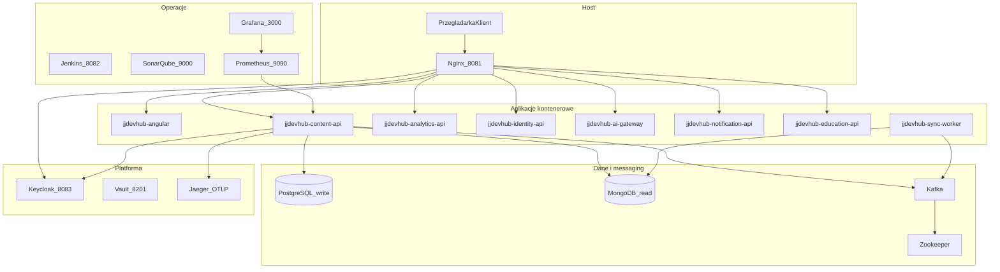
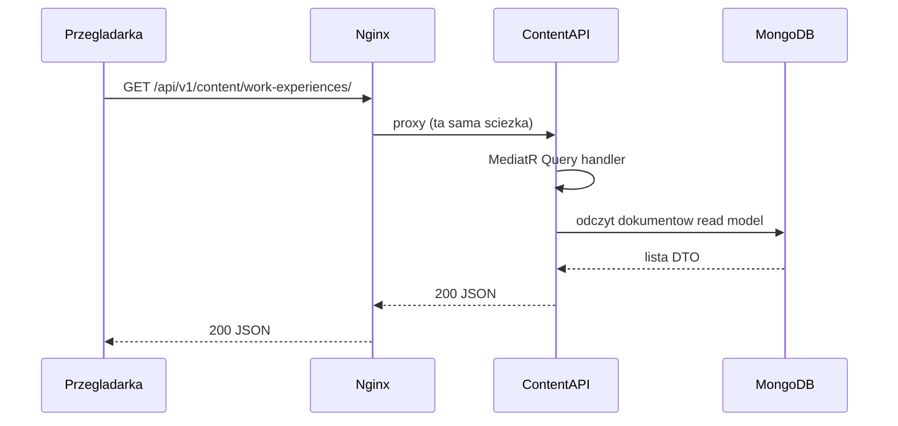
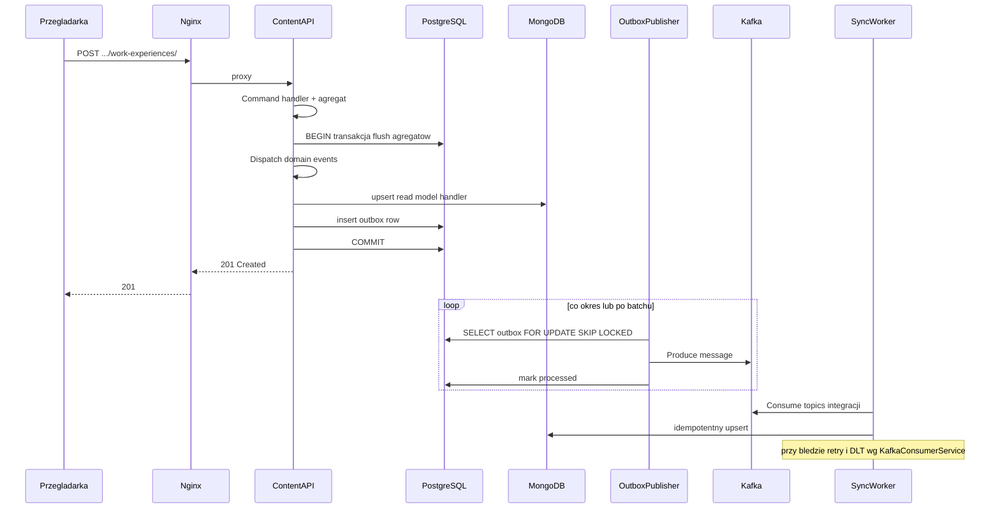
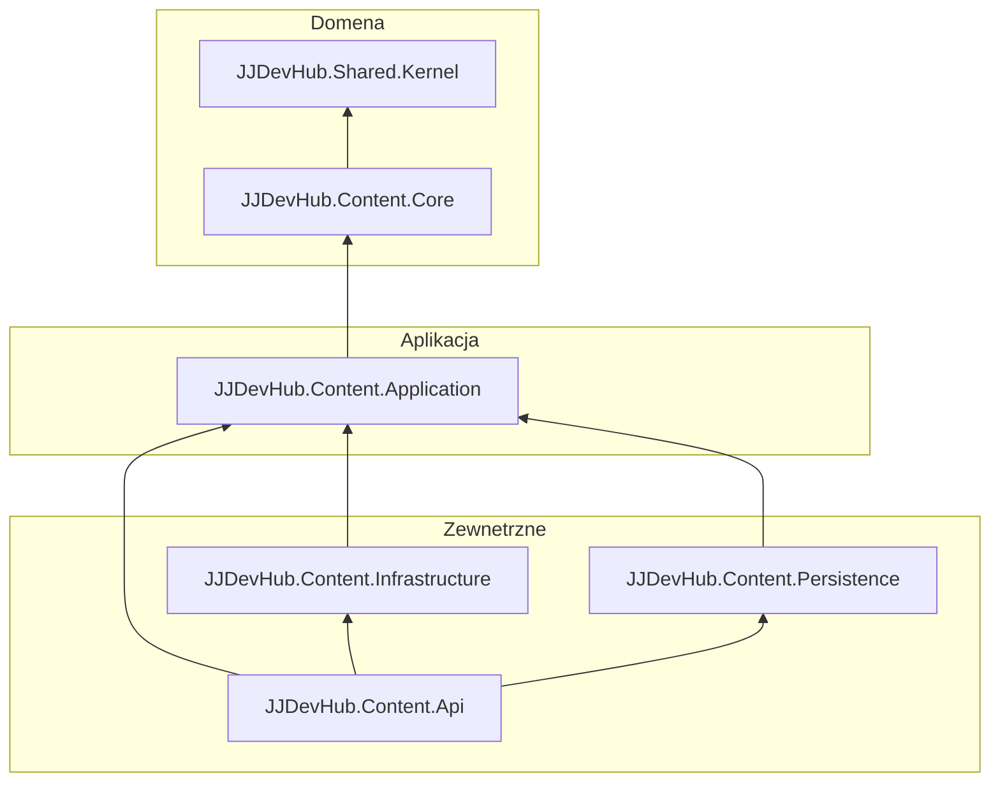

# JJDevHub — kompleksowy przewodnik: działanie, użycie, architektura, nauka

> Ten dokument **rozszerza i porządkuje** wiedzę z [architecture-tutorial.md](architecture-tutorial.md). Tutorial pozostaje **głębokim materiałem referencyjnym** (DDD, CQRS, fragmenty kodu). Tutaj znajdziesz **mapę całego systemu**, **przepływy end-to-end**, **praktyczny playbook** uruchomienia i weryfikacji, **pełny katalog kontenerów**, **FAQ** oraz **czego możesz się nauczyć** w kontekście portfolio i CV.

---

## Spis treści

1. [Jak korzystać z tego dokumentu](#1-jak-korzystać-z-tego-dokumentu)
2. [Czym jest JJDevHub (produkt)](#2-czym-jest-jjdevhub-produkt)
3. [Mapa systemu](#3-mapa-systemu)
4. [End-to-end: od żądania HTTP do baz i z powrotem](#4-end-to-end-od-żądania-http-do-baz-i-z-powrotem)
5. [Architektura wewnętrzna](#5-architektura-wewnętrzna)
6. [Katalog kontenerów](#6-katalog-kontenerów)
    - [6.1 Reverse proxy — nginx](#61-reverse-proxy--nginx)
    - [6.2 Bazy danych — db, mongodb, sonarqube-db](#62-bazy-danych)
    - [6.3 Messaging — zookeeper, kafka](#63-messaging--zookeeper-kafka)
    - [6.4 Platforma — keycloak, vault](#64-platforma--keycloak-vault)
    - [6.5 Observability — prometheus, grafana, jaeger](#65-observability--prometheus-grafana-jaeger)
    - [6.6 CI/CD — jenkins, sonarqube](#66-cicd--jenkins-sonarqube)
    - [6.7 Aplikacje — angular-web, content-api, analytics-api, identity-api, ai-gateway, notification-api, education-api, sync-worker](#67-aplikacje)
7. [Praktyczny playbook](#7-praktyczny-playbook)
8. [Bezpieczeństwo i IAM](#8-bezpieczeństwo-i-iam)
9. [CI/CD, jakość kodu, observability](#9-cicd-jakość-kodu-observability)
10. [Frontend (Angular) i mobile (React Native)](#10-frontend-angular-i-mobile-react-native)
11. [Czego się nauczysz — umiejętności i ścieżki nauki](#11-czego-się-nauczysz--umiejętności-i-ścieżki-nauki)
12. [Tutoriale technologii](#12-tutoriale-technologii)
13. [FAQ i troubleshooting](#13-faq-i-troubleshooting)
14. [Indeks linków](#14-indeks-linków)

---

## 1. Jak korzystać z tego dokumentu

| Potrzebujesz… | Zacznij od… |
|---------------|-------------|
| Teorii DDD, pełnych przykładów encji, MediatR, testów | [architecture-tutorial.md](architecture-tutorial.md) |
| **Obrazu całości** i **kolejności komponentów** | Sekcje [3](#3-mapa-systemu) i [4](#4-end-to-end-od-żądania-http-do-baz-i-z-powrotem) poniżej |
| **Uruchomienia i sprawdzenia „czy działa"** | [7. Praktyczny playbook](#7-praktyczny-playbook) |
| **Szczegółów danego kontenera** (zmienne, volumes, config) | [6. Katalog kontenerów](#6-katalog-kontenerów) |
| **Umiejętności pod CV / rozwój** | [11](#11-czego-się-nauczysz--umiejętności-i-ścieżki-nauki) |
| **Błędów compose / bazy / Kafka** | [12](#12-faq-i-troubleshooting) |

---

## 2. Czym jest JJDevHub (produkt)

Zgodnie z [README.md](../README.md) w repozytorium:

- **Publiczna strona (student / czytelnik):** treści edukacyjne, oś czasu doświadczeń zawodowych widoczna jako blog — nacisk na szybki **odczyt**.
- **Ukryty panel (Owner):** po stronie IAM (Keycloak, rola `Owner`) dostęp do zarządzania CV, generowania dokumentów, śledzenia aplikacji o pracę itd.

Architektonicznie jest to **system zorientowany na zdarzenia** z wyraźnym rozdziałem **zapisu (PostgreSQL + domena)** i **odczytu (MongoDB, modele zdenormalizowane)** oraz **Kafką** do integracji i odporności na awarie procesu.

---

## 3. Mapa systemu

### 3.1. Diagram (logiczny)



### 3.2. Tabela: serwisy i rola

Źródło routingu HTTP: [infra/docker/nginx/nginx.conf](../infra/docker/nginx/nginx.conf). Porty hosta: [infra/docker/docker-compose.yml](../infra/docker/docker-compose.yml).

| Element | Dostęp z hosta (typowo) | Rola |
|--------|-------------------------|------|
| **Nginx** | `http://localhost:8081` (HTTP), `444` (HTTPS z mapowania) | Jedyny publiczny „front" dla SPA i prefiksów `/api/...` |
| **angular-web** | tylko przez Nginx | SPA Angular 21 + Material |
| **content-api** | **brak** mapowania portu — tylko sieć Docker + Nginx | Główny bounded context: DDD, CQRS, transactional outbox, OpenTelemetry, Prometheus `/metrics` |
| **analytics-api** | przez Nginx `/api/analytics/` | Serwis analityczny |
| **identity-api** | `/api/identity/` | Tożsamość / integracja z ekosystemem IAM |
| **ai-gateway** | `/api/ai/` | Brama do usług AI |
| **notification-api** | `/api/notification/` | Powiadomienia |
| **education-api** | `/api/education/` | Warstwa edukacyjna API |
| **sync-worker** | brak HTTP dla użytkownika; wewnętrznie Kestrel + `/health` | Konsument Kafki → idempotentne upserty MongoDB, DLT |
| **db (Postgres)** | `localhost:5433` | Baza zapisu (EF Core, schemat `content`) |
| **mongodb** | `localhost:27018` | Read store (kolekcje dokumentów) |
| **kafka** | `localhost:29092` (z hosta), `kafka:9092` (w sieci compose) | Integracja asynchroniczna |
| **keycloak** | `localhost:8083` (+ `/auth/` przez Nginx) | OIDC, realmy, role (`Owner`, `Student`) |
| **vault** | `localhost:8201` | Sekrety (w dev Content API często `Vault:Enabled=false`) |
| **jaeger** | `localhost:16686` UI, OTLP gRPC `4317` | Ślady (tracing) |
| **prometheus / grafana** | `9090` / `3000` | Metryki i dashboardy |
| **sonarqube / jenkins** | `9000` / `8082` | Jakość kodu i pipeline |

---

## 4. End-to-end: od żądania HTTP do baz i z powrotem

### 4.1. Odczyt (Query) — przykład `GET` listy doświadczeń

Minimal API mapuje grupę pod **`/api/v{version}/content`** ([Program.cs](../src/Services/JJDevHub.Content/JJDevHub.Content.Api/Program.cs)). Dla wersji 1 i Nginx:

- **Kanoniczny URL:** `http://localhost:8081/api/v1/content/work-experiences/`

Handler zapytania czyta z **MongoDB** przez `IWorkExperienceReadStore` (implementacja w Infrastructure) — nie z PostgreSQL. Szczegóły w [architecture-tutorial.md — sekcja CQRS](architecture-tutorial.md#3-cqrs---command-query-responsibility-segregation).



### 4.2. Zapis (Command) — przykład dodania doświadczenia

1. **HTTP** → endpoint Minimal API → `IMediator.Send(command)`.
2. **Command handler** tworzy agregat (np. `WorkExperience.Create`), zapis przez repozytorium do **PostgreSQL**.
3. **`ContentDbContext.SaveChangesAsync`** (nadpisane) — transakcja: flush agregatów → **MediatR** dispatch zdarzeń domenowych → handlery **upsertują MongoDB** i **enqueue** wpisy **outbox** w tej samej transakcji (drugi flush + commit). Komentarz w kodzie opisuje znany kompromis (Mongo przed commit — patrz backlog [transactional-outbox-kafka.md](backlog/transactional-outbox-kafka.md)).
4. Odpowiedź HTTP wraca do klienta.
5. **Równolegle (po commicie):** `OutboxPublisherHostedService` ([OutboxPublisherHostedService.cs](../src/Services/JJDevHub.Content/JJDevHub.Content.Infrastructure/Messaging/OutboxPublisherHostedService.cs)) wybiera wiersze `FOR UPDATE SKIP LOCKED`, publikuje na **Kafka** (topic = nazwa typu zdarzenia integracyjnego), oznacza jako przetworzone.



### 4.3. Dlaczego jest zarówno Mongo w handlerze zdarzenia, jak i Sync Worker?

- **Handler zdarzenia domenowego** (w ramach transakcji aplikacji Content) stara się **natychmiast** zsynchronizować read model i przygotować **outbox** spójny z zapisem PostgreSQL.
- **Sync Worker** ([KafkaConsumerService.cs](../src/Services/JJDevHub.Sync/KafkaConsumerService.cs)) **ponownie** aplikuje te same klasy zdarzeń integracyjnych do MongoDB z Kafki: zapewnia **odporność** (np. gdy konsument był wyłączony), **idempotentne upserty** oraz obsługę **dead-letter topic** (`Sync:DeadLetterTopic` w `appsettings`) po wyczerpaniu prób.

W praktyce: **źródłem prawdy dla zapisu stanu biznesowego jest PostgreSQL**; **MongoDB** jest zoptymalizowanym widokiem do odczytu; **Kafka** rozdziela integrację w czasie.

### 4.4. Migracje bazy (Development / Docker)

Przy `ASPNETCORE_ENVIRONMENT=Development` Content API po starcie wywołuje `Database.Migrate()` ([Program.cs](../src/Services/JJDevHub.Content/JJDevHub.Content.Api/Program.cs)), dzięki czemu lokalny stack tworzy m.in. tabelę `content.outbox_messages` bez ręcznego `dotnet ef database update`.

---

## 5. Architektura wewnętrzna

### 5.1. Warstwy (Clean Architecture) — Content



Zależności idą **do środka**: **Api** → Application / Persistence / Infrastructure; **Application** → Core; **Core** zależy tylko od **Shared.Kernel**. Żadna warstwa domenowa nie zależy od EF Core, Kafki czy MongoDB. Pełny opis, diagramy klas i przykłady kodu: [architecture-tutorial.md — sekcje 2, 3, 5](architecture-tutorial.md).

### 5.2. Bounded context Content — agregaty

| Agregat | Klasa bazowa | Opis | Kluczowe Value Objects |
|---------|-------------|------|------------------------|
| **WorkExperience** | `AuditableAggregateRoot` | Doświadczenie zawodowe (firma, stanowisko, daty). Soft delete przez `Deactivate()`. | `DateRange` (start/end + `IsCurrent`, `DurationInMonths`) |
| **CurriculumVitae** | `AuditableAggregateRoot` | Dokument CV powiązany z właścicielem. Generowanie PDF (QuestPDF). | — |
| **JobApplication** | `AuditableAggregateRoot` | Śledzenie aplikacji o pracę: firma, stanowisko, status, notatki. | — |

Każdy agregat emituje **domain events** (`*Created`, `*Updated`, `*Deleted`), które handlery przetwarzają na upsert Mongo + outbox.

Endpointy w API:
- `WorkExperienceEndpoints.cs` — `/work-experiences`
- `CurriculumVitaeEndpoints.cs` — `/cv`
- `JobApplicationEndpoints.cs` — `/applications`

### 5.3. Transactional outbox — konfiguracja

W `appsettings.json` Content API:

| Klucz | Domyślna wartość | Opis |
|-------|-----------------|------|
| `Outbox:PublisherEnabled` | `true` | Włączenie/wyłączenie publikowania do Kafki |
| `Outbox:PollIntervalMs` | `1000` | Interwał pollingu (ms) gdy brak nowych wpisów |
| `Outbox:BatchSize` | `50` | Ile wpisów outbox przetworzyć w jednym batchu |
| `Outbox:ErrorBackoffMs` | `5000` | Czas oczekiwania po błędzie (ms) |

`OutboxPublisherHostedService` używa `SELECT ... FOR UPDATE SKIP LOCKED` — bezpieczny przy wielu instancjach API.

### 5.4. Wzorce (skrót)

| Wzorzec | Gdzie szukać |
|---------|----------------|
| Aggregate + domain events | `JJDevHub.Content.Core`, Shared.Kernel |
| CQRS + MediatR + FluentValidation | `JJDevHub.Content.Application` |
| Transactional outbox | `ContentDbContext`, `OutboxPublisherHostedService`, schemat `content` |
| Read models Mongo | `JJDevHub.Content.Infrastructure` |
| Minimal API + wersjonowanie | `JJDevHub.Content.Api` (Asp.Versioning) |

---

## 6. Katalog kontenerów

Źródło: [infra/docker/docker-compose.yml](../infra/docker/docker-compose.yml). Wszystkie kontenery pracują w jednej sieci bridge `jjdevhub-net` i komunikują się po nazwach serwisów (Docker DNS).

---

### 6.1. Reverse proxy — nginx

| | |
|---|---|
| **Kontener** | `jjdevhub-nginx` |
| **Obraz** | `nginx:alpine` |
| **Porty hosta** | `8081:80` (HTTP), `444:443` (HTTPS) |
| **Rola** | Jedyny punkt wejścia z hosta. Routuje żądania na podstawie ścieżki URL do odpowiedniego serwisu w sieci Docker. |
| **restart** | `always` |

**Volumes:**

| Host path | Container path | Tryb | Opis |
|-----------|---------------|------|------|
| `./nginx/nginx.conf` | `/etc/nginx/nginx.conf` | `:ro` | Plik konfiguracyjny z regułami routingu |

**depends_on:** angular-web, content-api, analytics-api, identity-api, ai-gateway, notification-api, education-api

**Konfiguracja — `nginx.conf`:**

Plik [infra/docker/nginx/nginx.conf](../infra/docker/nginx/nginx.conf) definiuje path-based routing:

| Location | Upstream | Uwagi |
|----------|----------|-------|
| `/api/v1/content/` | `jjdevhub-content-api:8080` | Kanoniczny prefix Content API |
| `/api/content/` | j.w. (rewrite na `/api/v1/content/`) | Legacy — kompatybilność wsteczna |
| `/api/analytics/` | `jjdevhub-analytics-api:8080` | |
| `/api/identity/` | `jjdevhub-identity-api:8080` | |
| `/api/ai/` | `jjdevhub-ai-gateway:8080` | |
| `/api/notification/` | `jjdevhub-notification-api:8080` | |
| `/api/education/` | `jjdevhub-education-api:8080` | |
| `/auth/` | `jjdevhub-keycloak:8080` (rewrite `/auth/` → `/`) | Keycloak OIDC |
| `/jenkins/` | `jjdevhub-jenkins:8080` | |
| `/` | `jjdevhub-angular:80` | **Catch-all** — musi być ostatni |

**Jak dostosować:**
- Dodać nowy serwis: dodaj `location /api/nowyprefix/ { proxy_pass http://nowy-serwis:8080; }` **przed** catch-all `/`.
- Wystawić Swagger Content API: dodaj `location /swagger/ { proxy_pass http://jjdevhub-content-api:8080; }`.
- Po zmianie: `docker compose restart nginx` (nie wymaga przebudowy).

**Weryfikacja:**
```bash
curl -s http://localhost:8081/api/v1/content/work-experiences/ | head
```

---

### 6.2. Bazy danych

#### db (PostgreSQL — Write DB)

| | |
|---|---|
| **Kontener** | `jjdevhub-db` |
| **Obraz** | `postgres:16-alpine` |
| **Porty hosta** | `5433:5432` |
| **Rola** | Baza zapisu (Command side). Schemat `content` z tabelami EF Core: `work_experiences`, `curriculum_vitaes`, `job_applications`, `outbox_messages`, `__EFMigrationsHistory`. |

**Zmienne środowiskowe:**

| Zmienna | Wartość | Opis |
|---------|---------|------|
| `POSTGRES_USER` | `postgres` | Użytkownik superadmin |
| `POSTGRES_PASSWORD` | `password` | Hasło (dev!) |
| `POSTGRES_DB` | `jjdevhub_content` | Baza tworzona automatycznie przy starcie |

**Volumes:**

| Nazwa | Container path | Opis |
|-------|---------------|------|
| `postgres_data` | `/var/lib/postgresql/data` | Trwałe dane — przeżywają `docker compose down` (nie `down -v`) |

**Connection string pattern:**
- Z kontenera: `Host=db;Port=5432;Database=jjdevhub_content;Username=postgres;Password=password`
- Z hosta: `Host=localhost;Port=5433;Database=jjdevhub_content;Username=postgres;Password=password`

**Jak dostosować:** Zmień `POSTGRES_PASSWORD` w compose **i** w `ConnectionStrings__ContentDb` content-api. Po zmianie hasła: `docker compose down -v` (kasuje dane!) i `up -d`.

**Weryfikacja:**
```bash
docker exec jjdevhub-db psql -U postgres -d jjdevhub_content -c "\dt content.*"
```

---

#### mongodb (Read DB)

| | |
|---|---|
| **Kontener** | `jjdevhub-mongo` |
| **Obraz** | `mongo:latest` |
| **Porty hosta** | `27018:27017` |
| **Rola** | Read store (Query side). Kolekcje dokumentów: `work_experiences`, `job_applications` itp. Zdenormalizowane modele gotowe do wyświetlenia. |

**Volumes:**

| Nazwa | Container path | Opis |
|-------|---------------|------|
| `mongo_data` | `/data/db` | Trwałe dane |

**Brak zmiennych env** — w dev bez autentykacji. W produkcji dodaj `MONGO_INITDB_ROOT_USERNAME` / `MONGO_INITDB_ROOT_PASSWORD` i zaktualizuj connection stringi.

**Connection string pattern:**
- Z kontenera: `mongodb://mongodb:27017`
- Z hosta: `mongodb://localhost:27018`

**Weryfikacja:**
```bash
docker exec jjdevhub-mongo mongosh --eval "db.getSiblingDB('jjdevhub_content_read').getCollectionNames()"
```

---

#### sonarqube-db (PostgreSQL dla SonarQube)

| | |
|---|---|
| **Kontener** | `jjdevhub-sonarqube-db` |
| **Obraz** | `postgres:16-alpine` |
| **Porty hosta** | **brak** (dostępny tylko w sieci Docker) |
| **Rola** | Dedykowana baza PostgreSQL dla SonarQube. Odseparowana od głównej bazy aplikacji. |

**Zmienne środowiskowe:**

| Zmienna | Wartość |
|---------|---------|
| `POSTGRES_USER` | `sonar` |
| `POSTGRES_PASSWORD` | `sonar` |
| `POSTGRES_DB` | `sonarqube` |

**Volumes:** `sonarqube_db_data` → `/var/lib/postgresql/data`

---

### 6.3. Messaging — zookeeper, kafka

#### zookeeper

| | |
|---|---|
| **Kontener** | `jjdevhub-zookeeper` |
| **Obraz** | `confluentinc/cp-zookeeper:7.6.1` |
| **Porty hosta** | **brak** (wewnętrzny `2181`) |
| **Rola** | Koordynacja klastra Kafka (wersje Confluent 7.6.x używają jeszcze ZooKeeper, nie KRaft). |

**Zmienne środowiskowe:**

| Zmienna | Wartość | Opis |
|---------|---------|------|
| `ZOOKEEPER_CLIENT_PORT` | `2181` | Port nasłuchu |

**Uwaga:** Nie używaj `confluentinc/cp-zookeeper:latest` — wymaga KRaft i innych zmiennych. Trzymaj się `7.6.1`.

---

#### kafka

| | |
|---|---|
| **Kontener** | `jjdevhub-kafka` |
| **Obraz** | `confluentinc/cp-kafka:7.6.1` |
| **Porty hosta** | `9092:9092`, `29092:29092` |
| **Rola** | Message broker (CQRS backbone). Topiki tworzone automatycznie (auto-create) z nazwami klas zdarzeń integracyjnych, np. `WorkExperienceCreatedIntegrationEvent`. |
| **depends_on** | `zookeeper` |

**Zmienne środowiskowe:**

| Zmienna | Wartość | Opis |
|---------|---------|------|
| `KAFKA_BROKER_ID` | `1` | ID brokera w klastrze |
| `KAFKA_ZOOKEEPER_CONNECT` | `zookeeper:2181` | Adres ZooKeeper |
| `KAFKA_ADVERTISED_LISTENERS` | `PLAINTEXT://kafka:9092,PLAINTEXT_HOST://localhost:29092` | **Dwa listenery:** `PLAINTEXT` dla kontenerów w sieci Docker, `PLAINTEXT_HOST` dla klientów z hosta |
| `KAFKA_LISTENER_SECURITY_PROTOCOL_MAP` | `PLAINTEXT:PLAINTEXT,PLAINTEXT_HOST:PLAINTEXT` | Mapowanie nazw listenerów na protokoły |
| `KAFKA_INTER_BROKER_LISTENER_NAME` | `PLAINTEXT` | Komunikacja między brokerami |
| `KAFKA_OFFSETS_TOPIC_REPLICATION_FACTOR` | `1` | Jeden broker = replication factor 1 |

**Jak dostosować:**
- **Z hosta** (`dotnet run`, narzędzia CLI): `BootstrapServers = localhost:29092`
- **Z kontenera** (content-api, sync-worker): `BootstrapServers = kafka:9092`
- Nie używaj `localhost:9092` z hosta — Kafka w metadanych zwróci `kafka:9092` jako adres brokera, co nie działa poza siecią Docker.

**Weryfikacja:**
```bash
docker exec jjdevhub-kafka kafka-topics --list --bootstrap-server localhost:9092
```

---

### 6.4. Platforma — keycloak, vault

#### keycloak

| | |
|---|---|
| **Kontener** | `jjdevhub-keycloak` |
| **Obraz** | `quay.io/keycloak/keycloak:26.0` |
| **Porty hosta** | `8083:8080` |
| **Rola** | Identity and Access Management. Zarządza realmem `jjdevhub`, klientami OIDC i rolami (`Owner`, `Student`). |
| **Command** | `start-dev --import-realm` |

**Zmienne środowiskowe:**

| Zmienna | Wartość | Opis |
|---------|---------|------|
| `KC_BOOTSTRAP_ADMIN_USERNAME` | `admin` | Admin konsoli (zmień w produkcji!) |
| `KC_BOOTSTRAP_ADMIN_PASSWORD` | `admin` | Hasło admina |

**Volumes:**

| Host path | Container path | Opis |
|-----------|---------------|------|
| `./keycloak` | `/opt/keycloak/data/import` | Folder z JSON-em realm (`jjdevhub-realm.json`). Import przy starcie (`--import-realm`). |

**Import realm definiuje:**
- **Realm** `jjdevhub` z rolami `Owner` i `Student`
- **Klient `jjdevhub-web`** — publiczny (`publicClient: true`), do SPA Angular
- **Klient `jjdevhub-api`** — poufny (`publicClient: false`), z sekretem `jjdevhub-api-dev-secret`, dla backend-to-backend

**Jak dostosować:**
- Edytuj `infra/docker/keycloak/jjdevhub-realm.json` i restartuj kontener.
- Dodaj nową rolę: w JSON `roles.realm` + w `Program.cs` Content API nową politykę.
- Admin UI: `http://localhost:8083` → admin/admin.

**Weryfikacja:**
```bash
curl -s http://localhost:8083/realms/jjdevhub/.well-known/openid-configuration | python -m json.tool | head
```

---

#### vault

| | |
|---|---|
| **Kontener** | `jjdevhub-vault` |
| **Obraz** | `hashicorp/vault:latest` |
| **Porty hosta** | `8201:8200` |
| **Rola** | Zarządzanie sekretami (connection stringi, tokeny). W dev startuje w trybie **dev server** — dane in-memory, resetują się po restarcie kontenera. |

**Zmienne środowiskowe:**

| Zmienna | Wartość | Opis |
|---------|---------|------|
| `VAULT_DEV_ROOT_TOKEN_ID` | `jjdevhub-root-token` | Stały token dev (używany w `Vault__Token` content-api) |
| `VAULT_ADDR` | `http://0.0.0.0:8200` | Adres nasłuchu wewnątrz kontenera |

**Uprawnienia:** `cap_add: IPC_LOCK` — wymagane przez Vault do lockowania pamięci (zapobiega swapowaniu sekretów na dysk).

**Bootstrap sekretów:** Po uruchomieniu kontenera sekrety trzeba załadować skryptem:

```bash
# Linux/macOS/Git Bash
./bootstrap-vault.sh

# Windows PowerShell
.\bootstrap-vault.ps1
```

Skrypty wykonują `docker exec` z tokenem i tworzą klucze KV v2 w ścieżkach:
- `secret/database/postgres` → `ConnectionStrings__ContentDb`
- `secret/database/mongodb` → `MongoDb__ConnectionString`, `MongoDb__DatabaseName`
- `secret/identity/tokens` → `recruiter-access-key`

**Jak dostosować:**
- W Content API: `Vault__Enabled: "true"` + `Vault__Token` + `Vault__Address` w compose.
- W dev często `Vault__Enabled: "false"` — sekrety wtedy z `appsettings.json` / zmiennych env.
- **Po restarcie kontenera** w dev: ponownie uruchom bootstrap (dane in-memory giną).

**Weryfikacja:**
```bash
docker exec -e VAULT_TOKEN=jjdevhub-root-token -e VAULT_ADDR=http://127.0.0.1:8200 jjdevhub-vault vault status
```

---

### 6.5. Observability — prometheus, grafana, jaeger

#### prometheus

| | |
|---|---|
| **Kontener** | `jjdevhub-prometheus` |
| **Obraz** | `prom/prometheus:latest` |
| **Porty hosta** | `9090:9090` |
| **Rola** | Scrape'uje metryki z aplikacji, przechowuje time series. |
| **restart** | `always` |

**Zmienne command:**

```yaml
command:
  - '--config.file=/etc/prometheus/prometheus.yml'
  - '--storage.tsdb.retention.time=30d'
```

Retencja danych: **30 dni**.

**Volumes:**

| Host path / nazwa | Container path | Opis |
|--------------------|---------------|------|
| `./monitoring/prometheus/prometheus.yml` | `/etc/prometheus/prometheus.yml` | `:ro` — konfiguracja scrape |
| `prometheus_data` | `/prometheus` | Trwałe dane metryk |

**Konfiguracja — `prometheus.yml`:**

Scrape targets z [prometheus.yml](../infra/docker/monitoring/prometheus/prometheus.yml):

| Job | Target | Metrics path | Interwał |
|-----|--------|-------------|----------|
| `prometheus` | `localhost:9090` | `/metrics` (domyślny) | 15s |
| `jjdevhub-content-api` | `jjdevhub-content-api:8080` | `/metrics` | 10s |
| `jjdevhub-jenkins` | `jjdevhub-jenkins:8080` | `/prometheus` | 15s |

**Jak dodać nowy target:** Edytuj `monitoring/prometheus/prometheus.yml`, dodaj nowy `job_name` z `static_configs.targets`. Restart: `docker compose restart prometheus`.

**Weryfikacja:** Otwórz `http://localhost:9090/targets` — status targetów.

---

#### grafana

| | |
|---|---|
| **Kontener** | `jjdevhub-grafana` |
| **Obraz** | `grafana/grafana:latest` |
| **Porty hosta** | `3000:3000` |
| **Rola** | Dashboardy wizualizujące metryki z Prometheus. Auto-provisioning datasource i dashboardów. |
| **restart** | `always` |
| **depends_on** | `prometheus` |

**Zmienne środowiskowe:**

| Zmienna | Wartość | Opis |
|---------|---------|------|
| `GF_SECURITY_ADMIN_USER` | `admin` | Login admina |
| `GF_SECURITY_ADMIN_PASSWORD` | `admin` | Hasło (zmień w produkcji!) |
| `GF_USERS_ALLOW_SIGN_UP` | `false` | Blokada rejestracji |

**Volumes:**

| Host path / nazwa | Container path | Tryb | Opis |
|--------------------|---------------|------|------|
| `grafana_data` | `/var/lib/grafana` | rw | Trwałe dane (sesje, alerty) |
| `./monitoring/grafana/provisioning` | `/etc/grafana/provisioning` | `:ro` | Auto-config datasources i dashboardów |
| `./monitoring/grafana/dashboards` | `/var/lib/grafana/dashboards` | `:ro` | Pliki JSON dashboardów |

**Provisioning automatyczny:**
- **Datasource** (`provisioning/datasources/datasources.yml`): Prometheus pod `http://jjdevhub-prometheus:9090`, ustawiony jako default.
- **Dashboard provider** (`provisioning/dashboards/dashboards.yml`): wczytuje JSON z `/var/lib/grafana/dashboards`.
- **Dashboardy JSON:** `content-api.json` (metryki HTTP, pamięć, GC), `infrastructure-overview.json`.

**Weryfikacja:** Otwórz `http://localhost:3000`, zaloguj admin/admin → folder "JJDevHub".

---

#### jaeger

| | |
|---|---|
| **Kontener** | `jjdevhub-jaeger` |
| **Obraz** | `jaegertracing/all-in-one:1.57` |
| **Porty hosta** | `16686:16686` (UI), `4317:4317` (OTLP gRPC) |
| **Rola** | Kolektor i wizualizacja śladów (traces). Content API wysyła trace'y przez OpenTelemetry OTLP gRPC na port `4317`. |
| **restart** | `always` |

**Brak zmiennych env** — all-in-one z domyślną konfiguracją (storage in-memory).

**Jak korzystać:**
1. Otwórz `http://localhost:16686`.
2. W polu „Service" wybierz `JJDevHub.Content.Api`.
3. Kliknij „Find Traces" — zobaczysz trace'y HTTP requestów z czasami poszczególnych operacji.

Content API wysyła trace'y gdy `OTEL_EXPORTER_OTLP_ENDPOINT` jest ustawiony (w compose: `http://jaeger:4317`).

---

### 6.6. CI/CD — jenkins, sonarqube

#### jenkins

| | |
|---|---|
| **Kontener** | `jjdevhub-jenkins` |
| **Obraz** | `jenkins/jenkins:lts-jdk17` |
| **Porty hosta** | `8082:8080` (UI), `50001:50000` (agent) |
| **Rola** | CI/CD pipeline (9 stage'ów). Buduje, testuje, analizuje jakość, buduje obrazy Docker, deployuje. |

**Volumes:**

| Nazwa | Container path | Opis |
|-------|---------------|------|
| `jenkins_home` | `/var/jenkins_home` | Cała konfiguracja Jenkinsa, pluginy, historia jobów |

**Brak zmiennych env w compose** — konfiguracja przez UI.

**Jak skonfigurować:**
1. Otwórz `http://localhost:8082`.
2. Początkowe hasło: `docker exec jjdevhub-jenkins cat /var/jenkins_home/secrets/initialAdminPassword`.
3. Zainstaluj sugerowane pluginy + Docker Pipeline + SonarQube Scanner.
4. Dodaj credentials: `sonarqube-token` (String) z tokenem z SonarQube.
5. Utwórz pipeline wskazujący na `Jenkinsfile` w repo.
6. Szczegółowy setup: [jenkins_tutorial.md](jenkins_tutorial.md).

**Weryfikacja:**
```bash
curl -s http://localhost:8082/login | head -5
```

---

#### sonarqube

| | |
|---|---|
| **Kontener** | `jjdevhub-sonarqube` |
| **Obraz** | `sonarqube:lts-community` |
| **Porty hosta** | `9000:9000` |
| **Rola** | Analiza statyczna kodu, pokrycie testami, Quality Gate. |
| **depends_on** | `sonarqube-db` |

**Zmienne środowiskowe:**

| Zmienna | Wartość | Opis |
|---------|---------|------|
| `SONAR_JDBC_URL` | `jdbc:postgresql://sonarqube-db:5432/sonarqube` | Połączenie z dedykowaną bazą |
| `SONAR_JDBC_USERNAME` | `sonar` | |
| `SONAR_JDBC_PASSWORD` | `sonar` | |

**Volumes:**

| Nazwa | Container path | Opis |
|-------|---------------|------|
| `sonarqube_data` | `/opt/sonarqube/data` | Dane analizy |
| `sonarqube_logs` | `/opt/sonarqube/logs` | Logi |
| `sonarqube_extensions` | `/opt/sonarqube/extensions` | Pluginy |

**Jak skonfigurować:**
1. Otwórz `http://localhost:9000` (start ~2 min).
2. Login: admin/admin (zmień po pierwszym logowaniu).
3. Wygeneruj token: My Account → Security → Generate Token.
4. Dodaj webhook do Jenkinsa: Administration → Webhooks → `http://jjdevhub-jenkins:8080/sonarqube-webhook/`.
5. Konfiguracja projektu: [sonar-project.properties](../sonar-project.properties).

**Weryfikacja:**
```bash
curl -s http://localhost:9000/api/system/status
```

---

### 6.7. Aplikacje

Wszystkie serwisy aplikacyjne budowane są z wieloetapowego Dockerfile: **SDK image** (build + publish) → **runtime image** (aspnet). Port wewnętrzny: **8080** (Kestrel default w .NET 10). Context build: root repo (`../..`), chyba że zaznaczono inaczej.

#### angular-web

| | |
|---|---|
| **Kontener** | `jjdevhub-angular` |
| **Dockerfile** | `src/Clients/web/Dockerfile` |
| **Build context** | `../../src/Clients/web` (folder frontendu) |
| **Rola** | SPA Angular 21 + Angular Material. Serwowany przez Nginx wewnątrz kontenera na porcie 80. |
| **restart** | `always` |

**Dockerfile (skrót):** `node:20-alpine` → `npm ci` → `ng build --production` → `nginx:alpine` serwuje z `/usr/share/nginx/html`.

**Brak zmiennych env w compose.** Konfiguracja API URL w `src/Clients/web/src/environments/environment.ts` **w czasie buildu** (nie runtime).

**Jak dostosować:**
- Zmień `contentApiUrl` / `keycloak.*` w `environment.ts` lub `environment.prod.ts`.
- Przebuduj: `docker compose build angular-web --no-cache`.

---

#### content-api

| | |
|---|---|
| **Kontener** | `jjdevhub-content-api` |
| **Dockerfile** | `src/Services/JJDevHub.Content/JJDevHub.Content.Api/Dockerfile` |
| **Rola** | Główny serwis biznesowy: DDD, CQRS, Minimal API, transactional outbox, OpenTelemetry, Swagger (Development), health checks (PostgreSQL, MongoDB, Keycloak, Vault). |
| **depends_on** | db, mongodb, kafka, keycloak, jaeger |
| **restart** | `always` |

**Dockerfile (skrót):** Kopiuje 6 plików `.csproj` (Shared.Kernel + 5 projektów Content) → `dotnet restore` → kopiuje kod → `dotnet publish -c Release`. Entrypoint: `dotnet JJDevHub.Content.Api.dll`.

**Zmienne środowiskowe (pełna lista):**

| Zmienna | Wartość w compose | Opis |
|---------|-------------------|------|
| `ASPNETCORE_ENVIRONMENT` | `Development` | Włącza Swagger, migracje auto, bogatsze logi |
| `ConnectionStrings__ContentDb` | `Host=db;Port=5432;Database=jjdevhub_content;Username=postgres;Password=password` | PostgreSQL w sieci Docker |
| `MongoDb__ConnectionString` | `mongodb://mongodb:27017` | MongoDB w sieci Docker |
| `MongoDb__DatabaseName` | `jjdevhub_content_read` | Nazwa bazy read |
| `Kafka__BootstrapServers` | `kafka:9092` | Kafka w sieci Docker |
| `Vault__Enabled` | `false` | Sekrety z Vault wyłączone (dev) |
| `Vault__Address` | `http://jjdevhub-vault:8200` | Adres Vault |
| `Vault__Token` | `${VAULT_TOKEN:-jjdevhub-root-token}` | Token; domyślnie dev root token |
| `Keycloak__realm` | `jjdevhub` | Realm OIDC |
| `Keycloak__auth-server-url` | `http://jjdevhub-keycloak:8080/` | Adres Keycloak w sieci Docker |
| `Keycloak__ssl-required` | `none` | Dev: HTTP |
| `Keycloak__resource` | `jjdevhub-api` | Client ID |
| `Keycloak__verify-token-audience` | `false` | |
| `Keycloak__credentials__secret` | `${KEYCLOAK_CLIENT_SECRET:-jjdevhub-api-dev-secret}` | Sekret klienta; domyślnie dev |
| `OTEL_EXPORTER_OTLP_ENDPOINT` | `http://jaeger:4317` | Endpoint OTLP dla trace'ów |

**Konfiguracja poza compose — `appsettings.json`:**

Klucze nie nadpisane przez compose (wartości lokalne dla `dotnet run`): `Outbox:*` (publisher), `Vault:*`, `Keycloak:*` (z pustym `auth-server-url` = bypass w dev).

**Weryfikacja:**
```bash
docker exec jjdevhub-content-api curl -s http://127.0.0.1:8080/health
docker exec jjdevhub-content-api curl -s http://127.0.0.1:8080/swagger/v1/swagger.json | head
```

**Typowe problemy:** Brak tabel → migracje nie wykonane (patrz [FAQ](#baza--outbox)). Błąd Keycloak → kontener keycloak jeszcze nie startował (depends_on nie czeka na ready).

---

#### analytics-api

| | |
|---|---|
| **Kontener** | `jjdevhub-analytics-api` |
| **Dockerfile** | `src/Services/JJDevHub.Analytics/JJDevHub.Analytics.Api/Dockerfile` |
| **Rola** | Serwis analityczny. Obecnie minimalny: endpoint `/health` na korzeniu. Struktura DDD przygotowana (Core, Application, Infrastructure, Api). |
| **restart** | `always` |

**Zmienne:** Tylko `ASPNETCORE_ENVIRONMENT: Development`.

**Dockerfile:** 4 projekty `.csproj` Analytics (Core, Application, Infrastructure, Api). Entrypoint: `dotnet JJDevHub.Analytics.Api.dll`.

**Weryfikacja:**
```bash
docker exec jjdevhub-analytics-api wget -qO- http://127.0.0.1:8080/health
```

---

#### identity-api

| | |
|---|---|
| **Kontener** | `jjdevhub-identity-api` |
| **Dockerfile** | `src/Services/JJDevHub.Identity/Dockerfile` |
| **Rola** | Serwis tożsamości. Obecnie minimalny: `/health`. |
| **restart** | `always` |

**Zmienne:** Tylko `ASPNETCORE_ENVIRONMENT: Development`.

**Weryfikacja:** `docker exec jjdevhub-identity-api wget -qO- http://127.0.0.1:8080/health`

---

#### ai-gateway

| | |
|---|---|
| **Kontener** | `jjdevhub-ai-gateway` |
| **Dockerfile** | `src/Services/JJDevHub.AI.Gateway/JJDevHub.AI.Gateway/Dockerfile` |
| **Rola** | Brama do usług AI. Obecnie minimalny: `/health`. |
| **restart** | `always` |

**Zmienne:** Tylko `ASPNETCORE_ENVIRONMENT: Development`.

**Weryfikacja:** `docker exec jjdevhub-ai-gateway wget -qO- http://127.0.0.1:8080/health`

---

#### notification-api

| | |
|---|---|
| **Kontener** | `jjdevhub-notification-api` |
| **Dockerfile** | `src/Services/JJDevHub.Notification/Dockerfile` |
| **Rola** | Serwis powiadomień. Obecnie minimalny: `/health`. |
| **restart** | `always` |

**Zmienne:** Tylko `ASPNETCORE_ENVIRONMENT: Development`.

**Weryfikacja:** `docker exec jjdevhub-notification-api wget -qO- http://127.0.0.1:8080/health`

---

#### education-api

| | |
|---|---|
| **Kontener** | `jjdevhub-education-api` |
| **Dockerfile** | `src/Services/JJDevHub.Education/Dockerfile` |
| **Rola** | Serwis edukacyjny. Obecnie minimalny: `/health`. |
| **restart** | `always` |

**Zmienne:** Tylko `ASPNETCORE_ENVIRONMENT: Development`.

**Weryfikacja:** `docker exec jjdevhub-education-api wget -qO- http://127.0.0.1:8080/health`

---

#### sync-worker

| | |
|---|---|
| **Kontener** | `jjdevhub-sync-worker` |
| **Dockerfile** | `src/Services/JJDevHub.Sync/Dockerfile` |
| **Rola** | Background service: konsumuje zdarzenia integracyjne z Kafki (6 topików), upsertuje read modele w MongoDB. Obsługuje retry z exponential backoff i dead-letter topic (DLT). Kestrel na `:8080` dla health checks. |
| **depends_on** | mongodb, kafka |
| **restart** | `always` |

**Dockerfile (skrót):** Kopiuje Shared.Kernel + Content (Core, Application, Persistence, Infrastructure) + Sync → publish. `ENV ASPNETCORE_URLS=http://+:8080`. Entrypoint: `dotnet JJDevHub.Sync.dll`.

**Zmienne środowiskowe:**

| Zmienna | Wartość | Opis |
|---------|---------|------|
| `ASPNETCORE_ENVIRONMENT` | `Development` | |
| `MongoDb__ConnectionString` | `mongodb://mongodb:27017` | MongoDB w sieci Docker |
| `MongoDb__DatabaseName` | `jjdevhub_content_read` | Baza read |
| `Kafka__BootstrapServers` | `kafka:9092` | Kafka w sieci Docker |

**Konfiguracja poza compose — `appsettings.json` sekcja `Sync`:**

| Klucz | Domyślna wartość | Opis |
|-------|-----------------|------|
| `Sync:DeadLetterTopic` | `jjdevhub-sync-worker-dlt` | Topic na nieprzetworzone wiadomości |
| `Sync:MaxHandlerAttempts` | `6` | Ile prób przed DLT |
| `Sync:ConsumerPollTimeoutSeconds` | `5` | Timeout poll Kafka |
| `Sync:HealthStalePollSeconds` | `90` | Health check: po ilu sekundach bez poll = unhealthy |
| `Sync:HealthStartupGraceSeconds` | `120` | Grace period na start przed health check failure |

**Subskrybowane topiki Kafki:**
- `WorkExperienceCreatedIntegrationEvent`
- `WorkExperienceUpdatedIntegrationEvent`
- `WorkExperienceDeletedIntegrationEvent`
- `JobApplicationCreatedIntegrationEvent`
- `JobApplicationUpdatedIntegrationEvent`
- `JobApplicationDeletedIntegrationEvent`

**Consumer group:** `jjdevhub-sync-worker` (manual commit, `AutoOffsetReset.Earliest`).

**Health checks:** `/health` — sprawdza stan konsumera Kafki (`KafkaConsumerHealthCheck`) i połączenie z MongoDB (`MongoHealthCheck`).

**Weryfikacja:**
```bash
docker exec jjdevhub-sync-worker wget -qO- http://127.0.0.1:8080/health
docker compose logs -f sync-worker
```

---

### Podsumowanie: volumes

| Volume | Kontener | Ścieżka | Dane |
|--------|---------|---------|------|
| `postgres_data` | db | `/var/lib/postgresql/data` | Baza zapisu |
| `mongo_data` | mongodb | `/data/db` | Read store |
| `jenkins_home` | jenkins | `/var/jenkins_home` | Konfiguracja CI/CD |
| `sonarqube_db_data` | sonarqube-db | `/var/lib/postgresql/data` | Baza SonarQube |
| `sonarqube_data` | sonarqube | `/opt/sonarqube/data` | Dane analizy |
| `sonarqube_logs` | sonarqube | `/opt/sonarqube/logs` | Logi |
| `sonarqube_extensions` | sonarqube | `/opt/sonarqube/extensions` | Pluginy |
| `prometheus_data` | prometheus | `/prometheus` | Metryki (30 dni retencji) |
| `grafana_data` | grafana | `/var/lib/grafana` | Sesje, alerty |

**Reset danych:** `docker compose down -v` kasuje **wszystkie** named volumes. Selektywnie: `docker volume rm jjdevhub_postgres_data`.

### Podsumowanie: sieć

Jedna sieć bridge: `jjdevhub-net`. Kontenery komunikują się po nazwach serwisów (Docker DNS). Porty wewnętrzne nie kolidują, bo każdy kontener ma własny network namespace.

---

## 7. Praktyczny playbook

### 7.1. Uruchomienie pełnego stacku

```bash
cd infra/docker
docker compose up -d --build
```

Aplikacja webowa: **http://localhost:8081**

### 7.2. Host (`dotnet run`) vs kontener

| Aplikacja działa na | PostgreSQL | MongoDB | Kafka bootstrap |
|---------------------|------------|---------|-----------------|
| Hoście, DB w Dockerze | `localhost:5433` | `localhost:27018` | `localhost:29092` |
| W sieci `docker compose` | `db:5432` | `mongodb:27017` | `kafka:9092` |

### 7.3. Weryfikacja frontu

1. Otwórz **http://localhost:8081** — Angular za Nginx.
2. Content API z przeglądarki (publiczny odczyt):
   **http://localhost:8081/api/v1/content/work-experiences/**
   (lub legacy: `/api/content/work-experiences/` → przepisane na v1 w Nginx).

### 7.4. Health Content API

`MapHealthChecks("/health")` jest na **korzeniu** aplikacji ASP.NET, **poza** prefiksem `/api/v1/content`. Nginx **nie** mapuje `/health` na Content API — żądanie `http://localhost:8081/health` trafia w **catch-all** do Angulara.

**Sprawdzenie health w kontenerze:**

```bash
docker exec jjdevhub-content-api curl -s http://127.0.0.1:8080/health
```

### 7.5. Swagger / OpenAPI (Content API)

Swagger UI jest włączany tylko gdy `IsDevelopment()`: `UseSwagger`, `UseSwaggerUI`, endpoint `/swagger/v1/swagger.json`.

Port **8080** Content API **nie jest** wystawiony na hosta w domyślnym compose. Opcje:

- Pobrać definicję z kontenera:
  `docker exec jjdevhub-content-api curl -s http://127.0.0.1:8080/swagger/v1/swagger.json`
- Tymczasowo dodać port w compose (`docker-compose.override.yml` lub edycja compose):
  ```yaml
  content-api:
    ports:
      - "5005:8080"
  ```
  Po tym Swagger UI: `http://localhost:5005/swagger`.
- Dodać `location /swagger/` w `nginx.conf` wskazujący na `jjdevhub-content-api:8080`.

### 7.6. Uruchomienie hybrydowe (same bazy w Dockerze)

```bash
cd infra/docker
docker compose up -d db mongodb kafka zookeeper
cd ../..
dotnet run --project src/Services/JJDevHub.Content/JJDevHub.Content.Api/JJDevHub.Content.Api.csproj
```

Ustaw w `appsettings` / user secrets connection stringi na **localhost** z portami z mapowania (patrz [architecture-tutorial.md sekcja 11](architecture-tutorial.md#11-jak-uruchomić-projekt)).

Frontend dev:

```bash
cd src/Clients/web
npm install
npm start
# http://localhost:4200 — w environment.ts ustaw contentApiUrl na bezposredni URL API
```

### 7.7. Logi kontenerów

```bash
# Stream logów jednego serwisu
docker compose logs -f content-api

# Ostatnie 100 linii
docker compose logs --tail 100 sync-worker

# Wszystkie serwisy naraz
docker compose logs -f
```

### 7.8. Przebudowa jednego serwisu

```bash
# Przebudowa bez cache
docker compose build content-api --no-cache

# Przebudowa i restart
docker compose up -d --build content-api

# Restart bez przebudowy (np. po zmianie env w compose)
docker compose restart content-api
```

### 7.9. Reset danych

```bash
# Zatrzymanie + usunięcie WSZYSTKICH volumes (utrata danych!)
docker compose down -v

# Selektywne usunięcie jednego volume
docker compose down
docker volume rm docker_postgres_data    # nazwa z docker volume ls
docker compose up -d

# Reset samej bazy Mongo (zachowaj PG)
docker compose stop mongodb
docker volume rm docker_mongo_data
docker compose up -d mongodb
```

### 7.10. Testy

```bash
# Jednostkowe (bez Docker)
dotnet test tests/JJDevHub.Content.UnitTests/ --configuration Release

# Integracyjne (wymagany Docker — Testcontainers)
dotnet test tests/JJDevHub.Content.IntegrationTests/ --configuration Release
```

---

## 8. Bezpieczeństwo i IAM

### 8.1. Keycloak — klienty i role

| Klient | Typ | Opis | Gdzie skonfigurowany |
|--------|-----|------|---------------------|
| `jjdevhub-web` | **publiczny** (`publicClient: true`) | Dla SPA Angular. `standardFlowEnabled: true`, redirect URIs na localhost. | `infra/docker/keycloak/jjdevhub-realm.json` |
| `jjdevhub-api` | **poufny** (`publicClient: false`) | Backend-to-backend. Sekret: `jjdevhub-api-dev-secret`. `serviceAccountsEnabled: true`. | j.w. + `Keycloak__credentials__secret` w compose |

**Role realm:**
- `Owner` — pełen dostęp (CRUD, CV, aplikacje).
- `Student` — odczyt publiczny.

**Polityka w Content API:**
```
options.AddPolicy("OwnerOnly", policy => policy.RequireRealmRoles("Owner"));
```
W Development bez skonfigurowanego `Keycloak:auth-server-url`: polityka przepuszcza wszystko (`RequireAssertion(_ => true)`).

### 8.2. Vault — bootstrap sekretów

Vault startuje w **trybie dev** (dane in-memory). Po każdym restarcie kontenera:

```bash
# Linux/macOS/Git Bash
cd infra/docker
./bootstrap-vault.sh

# Windows PowerShell
cd infra\docker
.\bootstrap-vault.ps1
```

**Co robi bootstrap:**
1. Montuje KV v2 engine pod ścieżką `secret/` (ignoruje błąd jeśli już istnieje).
2. `vault kv put secret/database/postgres` → connection string PG z adresami Docker.
3. `vault kv put secret/database/mongodb` → connection string Mongo.
4. `vault kv put secret/keycloak/clients` → sekret Keycloak klienta (tylko bash).
5. `vault kv put secret/identity/tokens` → `recruiter-access-key`.

**W Content API:** `Vault:Enabled: false` w compose = Vault pominięty, sekrety z env vars / appsettings. Zmień na `true` i ustaw `Vault:Address` + `Vault:Token` aby aktywować.

### 8.3. Rate limiting

Content API definiuje dwie polityki w `Program.cs`:
- **Globalny:** 300 żądań / minutę per IP.
- **`writes`:** 60 żądań / minutę per IP (dla endpointów modyfikujących).

---

## 9. CI/CD, jakość kodu, observability

### 9.1. Jenkins

Pipeline z 9 stage'ów: Restore → Build → Unit Tests → Integration Tests → SonarQube Analysis → Quality Gate → Angular Build → Docker Build (8 parallel) → Deploy.

Szczegóły: [Jenkinsfile](../Jenkinsfile), [jenkins_tutorial.md](jenkins_tutorial.md).

### 9.2. SonarQube

Konfiguracja projektu: [sonar-project.properties](../sonar-project.properties). Quality Gate ("Sonar way") blokuje pipeline jeśli: coverage < 80%, duplikacja > 3%, rating poniżej A.

### 9.3. Prometheus — scrape targets

Z pliku [prometheus.yml](../infra/docker/monitoring/prometheus/prometheus.yml):

| Job | Target | Path | Interwał | Labele |
|-----|--------|------|----------|--------|
| `prometheus` | `localhost:9090` | `/metrics` | 15s | — |
| `jjdevhub-content-api` | `jjdevhub-content-api:8080` | `/metrics` | 10s | `service: content-api`, `environment: docker` |
| `jjdevhub-jenkins` | `jjdevhub-jenkins:8080` | `/prometheus` | 15s | `service: jenkins` |

Dodaj nowy serwis do monitorowania: edytuj `prometheus.yml` → `docker compose restart prometheus`.

### 9.4. Grafana — auto-provisioning

Przy starcie Grafana automatycznie:
1. **Datasource** — Prometheus (`http://jjdevhub-prometheus:9090`) jako default.
2. **Dashboardy** — wczytuje JSON z katalogu `dashboards/`:
   - `content-api.json` — panele: HTTP request rate, latency p95, error rate 5xx, pamięć, GC.
   - `infrastructure-overview.json` — przegląd infrastruktury.

Dashboardy są w folderze "JJDevHub" w Grafana UI.

### 9.5. Jaeger — ślady

1. **UI:** `http://localhost:16686`
2. Wybierz service `JJDevHub.Content.Api` → Find Traces.
3. Każdy trace pokazuje: czas HTTP requestu, operacje EF Core, połączenia Mongo.

Content API wysyła trace'y przez **OpenTelemetry OTLP gRPC** na `jaeger:4317` (zmienna `OTEL_EXPORTER_OTLP_ENDPOINT` w compose).

### 9.6. OpenTelemetry w Content API

Metryki:
- `AddAspNetCoreInstrumentation()` — HTTP request duration, active requests
- `AddRuntimeInstrumentation()` — GC collections, thread pool, working set
- `AddPrometheusExporter()` → endpoint `/metrics`

Tracing:
- `AddAspNetCoreInstrumentation()` — HTTP spans
- `AddOtlpExporter()` → gRPC do Jaeger (gdy `OTEL_EXPORTER_OTLP_ENDPOINT` ustawiony)

---

## 10. Frontend (Angular) i mobile (React Native)

### 10.1. Angular

- Konfiguracja: [src/Clients/web/src/environments/environment.ts](../src/Clients/web/src/environments/environment.ts)
  - `contentApiUrl`: **`http://localhost:8081/api/v1/content`** (przez Nginx w stacku Docker).
  - `keycloak.url` puste = tryb bez logowania; `allowAdminWithoutAuth: true` ułatwia dev.
- Serwisy HTTP: np. [api.service.ts](../src/Clients/web/src/app/services/api.service.ts) używa `environment.contentApiUrl`.

### 10.2. React Native

Projekt: [src/Clients/mobile/JJDevHubMobile/](../src/Clients/mobile/JJDevHubMobile/) — ekrany, serwisy API, modele TypeScript; ten przewodnik nie zastępuje README mobilnego, ale **w kontekście architektury**: ten sam backend i te same zasady wersjonowania ścieżek API co web.

---

## 11. Czego się nauczysz — umiejętności i ścieżki nauki

### 11.1. Macierz: temat → miejsce w repo → słowo do CV

| Temat | Gdzie w repo | Jak formułować umiejętność |
|-------|----------------|----------------------------|
| DDD, agregaty, value objects | `JJDevHub.Content.Core`, `Shared.Kernel` | Modelowanie domeny, invarianty, encje vs VO |
| CQRS | `Application/Commands`, `Application/Queries` | Rozdział odczytu i zapisu, handlery |
| MediatR, pipeline | `ValidationBehavior`, rejestracja DI | Mediator, cross-cutting (walidacja) |
| EF Core, migracje, schematy | `JJDevHub.Content.Persistence` | PostgreSQL, Fluent API, `Migrate()` w dev |
| Transactional outbox | `ContentDbContext`, `Outbox*`, publisher | Spójność z Kafka, `SKIP LOCKED` |
| MongoDB read models | `Infrastructure/ReadStore` | Document store, projekcje |
| Kafka (producer/consumer) | `KafkaEventBus`, `JJDevHub.Sync` | Event-driven integration, DLT, consumer groups |
| Minimal API + versioning | `JJDevHub.Content.Api` | ASP.NET Core 10, API versioning |
| Keycloak / JWT | `Program.cs`, Angular `app.config` | OIDC, RBAC |
| OpenTelemetry | `Program.cs` (Content) | Observability, metrics, traces |
| Docker Compose | `infra/docker` | Multi-container dev, sieci, volumes |
| Nginx reverse proxy | `infra/docker/nginx/nginx.conf` | Routing, path-based proxy |
| Testy | `tests/JJDevHub.Content.*` | xUnit, FluentAssertions, NSubstitute, Testcontainers |
| CI/CD | `Jenkinsfile` | Pipeline wieloetapowy |
| Jakość | SonarQube, Quality Gate | Statyczna analiza, coverage |

### 11.2. Ścieżki nauki

**Poziom 1 — orientacja (1–2 dni)**
Przeczytaj [sekcje 3–4](#3-mapa-systemu) tego dokumentu, uruchom compose, wywołaj `GET` na listę work experiences, zajrzyj w logi `content-api` i `sync-worker`.

**Poziom 2 — przepływ zapisu (3–7 dni)**
W [architecture-tutorial.md](architecture-tutorial.md) przejdź CQRS + domain events + `SaveChangesAsync`. W kodzie śledź jedną komendę od endpointu do outboxa. Porównaj z [transactional-outbox-kafka.md](backlog/transactional-outbox-kafka.md).

**Poziom 3 — produkcyjne myślenie (tydzień+)**
Jenkins + Sonar, metryki w Prometheus/Grafana, ślady w Jaeger, scenariusze awarii Kafki (wyłącz sync-worker, obserwuj nadganianie po starcie).

### 11.3. Propozycje ćwiczeń

1. Dodać pole do agregatu i przeprowadzić migrację EF + aktualizację read modelu i eventów.
2. Dodać nowy endpoint tylko do odczytu z Mongo (query + test integracyjny).
3. Wyłączyć tymczasowo `Outbox:PublisherEnabled` i zaobserwować zachowanie kolejki outbox (patrz `OutboxPublisherHostedService`).
4. Skonfigurować Keycloak w `environment.ts` i przejść flow logowania jako `Owner`.
5. Dodać nowy target do `prometheus.yml` i sprawdzić metryki w Grafana.
6. Śledzić trace jednego POST request w Jaeger UI.

### 11.4. Literatura (skrót)

Jak w końcu [architecture-tutorial.md — Materiały dodatkowe](architecture-tutorial.md#materiały-dodatkowe): Evans, Vernon, Clean Architecture — oraz oficjalna dokumentacja ASP.NET, EF Core, Confluent Kafka, Keycloak.

---

## 12. Tutoriale technologii

Poniżej mini-tutorial dla każdej technologii użytej w JJDevHub: **co to jest**, **jak działa w tym projekcie**, **kluczowe koncepty** i **gdzie szukać w kodzie**. Kolejność od backendu przez infrastrukturę po frontend.

---

### 12.1. .NET 10 / ASP.NET Core — Minimal API

**Co to jest:** Framework do budowania API i aplikacji webowych w C#. JJDevHub używa **Minimal API** (bez kontrolerów MVC) — endpointy definiowane jako delegaty w metodach rozszerzających.

**Jak działa w projekcie:**

```csharp
var content = app.MapGroup("/api/v{apiVersion:apiVersion}/content")
    .WithApiVersionSet(apiVersionSet);
content.MapWorkExperienceEndpoints();
```

Każdy zestaw endpointów to metoda rozszerzająca `IEndpointRouteBuilder` w osobnym pliku (np. `WorkExperienceEndpoints.cs`). Request trafia do handlera MediatR.

**Kluczowe koncepty:**
- **Dependency Injection** — `builder.Services.AddScoped/Singleton/Transient` w `Program.cs` i w `DependencyInjection.cs` każdej warstwy.
- **Middleware pipeline** — kolejność ma znaczenie: `UseAuthentication()` → `UseAuthorization()` → `UseRateLimiter()`.
- **API Versioning** — `Asp.Versioning.Http`, domyślna wersja 1.0, route `v{apiVersion:apiVersion}`.
- **Output caching** — polityka `PublicWorkExperiences` (60s, vary by query).
- **Rate limiting** — globalny (300/min) i `writes` (60/min) per IP.

**Gdzie w kodzie:**
- `src/Services/JJDevHub.Content/JJDevHub.Content.Api/Program.cs` — composition root
- `src/Services/JJDevHub.Content/JJDevHub.Content.Api/Endpoints/` — endpointy

**Oficjalna dokumentacja:** https://learn.microsoft.com/aspnet/core

---

### 12.2. Entity Framework Core (EF Core)

**Co to jest:** ORM (Object-Relational Mapper) dla .NET. Mapuje klasy C# na tabele PostgreSQL, zarządza migracjami schematu, śledzi zmiany (change tracking) i realizuje Unit of Work.

**Jak działa w projekcie:**

`ContentDbContext` dziedziczy po `DbContext` i implementuje `IUnitOfWork`. Nadpisuje `SaveChangesAsync` dodając: audit info, transakcję, dispatch domain events, flush outbox.

**Kluczowe koncepty:**
- **Fluent API configuration** — pliki w `Persistence/Configurations/`, np. `WorkExperienceConfiguration.cs`. Owned types dla Value Objects (`DateRange`).
- **Migracje** — folder `Persistence/Migrations/`. Tworzenie: `dotnet ef migrations add <Nazwa>`. Aplikowanie: `dotnet ef database update` lub auto w Development (`Database.Migrate()`).
- **Global query filters** — `HasQueryFilter(e => e.IsActive)` — soft-deleted rekordy pomijane automatycznie.
- **Schemat** — `modelBuilder.HasDefaultSchema("content")` — wszystkie tabele w schemacie `content`.
- **`InternalsVisibleTo`** — `AuditableEntity` ma `internal` metody `ApplyPersistenceOnCreate/Modify`, dostępne dla `Persistence` przez atrybut assembly.

**Gdzie w kodzie:**
- `src/Services/JJDevHub.Content/JJDevHub.Content.Persistence/ContentDbContext.cs`
- `src/Services/JJDevHub.Content/JJDevHub.Content.Persistence/Configurations/`
- `src/Services/JJDevHub.Content/JJDevHub.Content.Persistence/Migrations/`

**Komendy:**
```bash
dotnet ef migrations add NazwaMigracji \
  --project src/Services/JJDevHub.Content/JJDevHub.Content.Persistence \
  --startup-project src/Services/JJDevHub.Content/JJDevHub.Content.Api

dotnet ef database update \
  --project src/Services/JJDevHub.Content/JJDevHub.Content.Persistence \
  --startup-project src/Services/JJDevHub.Content/JJDevHub.Content.Api
```

---

### 12.3. PostgreSQL

**Co to jest:** Relacyjna baza danych open-source. W JJDevHub pełni rolę **write store** (Command side CQRS).

**Jak działa w projekcie:**

Kontener `jjdevhub-db` z obrazem `postgres:16-alpine`. Baza `jjdevhub_content`, schemat `content` z tabelami: `work_experiences`, `curriculum_vitaes`, `job_applications`, `outbox_messages`, `__EFMigrationsHistory`.

**Kluczowe koncepty:**
- **Schemat (`content`)** — separacja logiczna od ewentualnych innych schematów.
- **`FOR UPDATE SKIP LOCKED`** — w outbox publisher: blokada wierszy bez czekania na inne transakcje (bezpieczne przy wielu instancjach).
- **Transakcje** — `ContentDbContext.SaveChangesAsync` otwiera explicit transaction, commituje atomowo agregaty + outbox.

**Połączenie z hosta:**
```bash
psql -h localhost -p 5433 -U postgres -d jjdevhub_content
# lub
docker exec -it jjdevhub-db psql -U postgres -d jjdevhub_content
```

**Przydatne zapytania:**
```sql
-- Lista tabel
\dt content.*

-- Nieprzetworzone outbox entries
SELECT * FROM content.outbox_messages WHERE processed_utc IS NULL ORDER BY created_utc;

-- Historia migracji
SELECT * FROM content."__EFMigrationsHistory";
```

---

### 12.4. MongoDB

**Co to jest:** Dokumentowa baza NoSQL. W JJDevHub pełni rolę **read store** (Query side CQRS) — przechowuje zdenormalizowane modele gotowe do wyświetlenia.

**Jak działa w projekcie:**

Kontener `jjdevhub-mongo`. Baza `jjdevhub_content_read`. Kolekcje: `work_experiences`, `job_applications`. Dokumenty upsertowane przez domain event handlery (synchronicznie w transakcji Content API) oraz idempotentnie przez Sync Worker (z Kafki).

**Kluczowe koncepty:**
- **Upsert** — `ReplaceOneAsync` z `IsUpsert = true` — wstawia lub nadpisuje dokument po `_id`.
- **Filtrowanie** — `Builders<T>.Filter.Eq(d => d.IsPublic, true)` — type-safe query builder.
- **Sortowanie** — `Builders<T>.Sort.Descending(d => d.StartDate)`.
- **Brak transakcji między PG a Mongo** — znany kompromis; Mongo upsert wykonany przed commit PG (patrz [transactional-outbox-kafka.md](backlog/transactional-outbox-kafka.md)).

**Połączenie z hosta:**
```bash
mongosh --port 27018
# lub
docker exec -it jjdevhub-mongo mongosh
```

**Przydatne komendy:**
```javascript
use jjdevhub_content_read
db.work_experiences.find().pretty()
db.work_experiences.countDocuments()
db.job_applications.find({ isActive: true })
```

**Gdzie w kodzie:**
- `src/Services/JJDevHub.Content/JJDevHub.Content.Infrastructure/ReadStore/`
- `src/Services/JJDevHub.Sync/KafkaConsumerService.cs`

---

### 12.5. Apache Kafka

**Co to jest:** Rozproszony message broker typu publish-subscribe. W JJDevHub stanowi **kręgosłup integracji asynchronicznej** między Content API a Sync Worker.

**Jak działa w projekcie:**

1. `OutboxPublisherHostedService` (Content API) czyta wpisy outbox z PG i publikuje na Kafka. Topic = nazwa klasy zdarzenia (np. `WorkExperienceCreatedIntegrationEvent`).
2. `KafkaConsumerService` (Sync Worker) subskrybuje 6 topików, upsertuje Mongo, obsługuje DLT.

**Kluczowe koncepty:**
- **Topiki** — auto-created, nazwane po typach zdarzeń integracyjnych.
- **Consumer group** — `jjdevhub-sync-worker` z manual commit (`EnableAutoCommit = false`).
- **Dwa listenery** — `PLAINTEXT` (kafka:9092 dla kontenerów), `PLAINTEXT_HOST` (localhost:29092 dla hosta).
- **Dead Letter Topic (DLT)** — `jjdevhub-sync-worker-dlt` — wiadomości po wyczerpaniu prób (`MaxHandlerAttempts: 6`).
- **Idempotentny producer** — `EnableIdempotence = true`, `Acks = All`.

**Narzędzia CLI (w kontenerze):**
```bash
# Lista topików
docker exec jjdevhub-kafka kafka-topics --list --bootstrap-server localhost:9092

# Podgląd wiadomości na topiku
docker exec jjdevhub-kafka kafka-console-consumer \
  --bootstrap-server localhost:9092 \
  --topic WorkExperienceCreatedIntegrationEvent \
  --from-beginning --max-messages 5

# Sprawdzenie offsetów consumer group
docker exec jjdevhub-kafka kafka-consumer-groups \
  --bootstrap-server localhost:9092 \
  --group jjdevhub-sync-worker --describe
```

**Gdzie w kodzie:**
- Producer: `src/Services/JJDevHub.Content/JJDevHub.Content.Infrastructure/Messaging/`
- Consumer: `src/Services/JJDevHub.Sync/KafkaConsumerService.cs`

---

### 12.6. MediatR

**Co to jest:** Biblioteka implementująca wzorzec **Mediator** dla .NET. Rozdziela nadawcę żądania od handlera — brak bezpośrednich zależności między endpointami a logiką biznesową.

**Jak działa w projekcie:**

Endpoint wysyła command/query: `mediator.Send(command)`. MediatR znajduje odpowiedni handler na podstawie typu. Przed handlerem uruchamia **pipeline behaviors** (np. walidacja).

**Kluczowe koncepty:**
- **`ICommand<TResponse>` / `IQuery<TResponse>`** — interfejsy CQRS w `Shared.Kernel`, oparte na `IRequest<T>` z MediatR.
- **`ICommandHandler` / `IQueryHandler`** — handlery, oparte na `IRequestHandler`.
- **`INotification` / `INotificationHandler`** — domain events (`IDomainEvent : INotification`). Dispatch przez `_mediator.Publish(event)`.
- **`IPipelineBehavior`** — `ValidationBehavior` uruchamia FluentValidation przed każdym handlerem. Błędy walidacji → `ValidationException` → 400 Bad Request.

**Gdzie w kodzie:**
- Interfejsy: `src/Services/JJDevHub.Shared.Kernel/BuildingBlocks/`
- Behaviors: `src/Services/JJDevHub.Content/JJDevHub.Content.Application/Behaviors/`
- Commands/Queries: `src/Services/JJDevHub.Content/JJDevHub.Content.Application/Commands/` i `Queries/`

---

### 12.7. FluentValidation

**Co to jest:** Biblioteka do deklaratywnej walidacji obiektów w .NET. Definiujesz reguły walidacji w osobnych klasach `AbstractValidator<T>`.

**Jak działa w projekcie:**

Każdy command ma swój validator (np. `AddWorkExperienceCommandValidator`). Validatory rejestrowane automatycznie: `services.AddValidatorsFromAssembly(assembly)`. Uruchamiane przez `ValidationBehavior` w pipeline MediatR.

**Kluczowe koncepty:**
- **Dwa poziomy walidacji:** FluentValidation (format/struktura — puste pola, długość, zakresy dat) + domain validation (reguły biznesowe — w encji).
- **Reguły:** `RuleFor(x => x.CompanyName).NotEmpty().MaximumLength(200)`.
- **Warunkowe:** `.When(x => x.EndDate.HasValue)`.

**Gdzie w kodzie:**
- Validatory obok commandów: `Application/Commands/AddWorkExperience/AddWorkExperienceCommandValidator.cs`

---

### 12.8. Domain-Driven Design (DDD)

**Co to jest:** Podejście do projektowania oprogramowania, w którym **model domenowy** odzwierciedla rzeczywisty świat biznesu. Kod organizowany wokół **Bounded Contexts** (autonomicznych modeli).

**Jak działa w projekcie:**

Warstwa `Core` (domena) nie zależy od żadnej innej. Zawiera encje, Value Objects, eventy domenowe, interfejsy repozytoriów. Bounded Context: **Content** (CV, doświadczenie, aplikacje).

**Kluczowe koncepty:**
- **Aggregate Root** — klasa bazowa `AggregateRoot` (`Shared.Kernel`). Zarządza spójnością transakcyjną. Przykłady: `WorkExperience`, `CurriculumVitae`, `JobApplication`.
- **Entity** — obiekt z tożsamością (`Id`). Bazowa klasa `AuditableEntity` z polami audytowymi (`CreatedAt`, `ModifiedAt`, `CreatedBy`).
- **Value Object** — obiekt bez tożsamości, porównywany po wartości. Np. `DateRange(StartDate, EndDate?)`, `Money(Amount, Currency)`.
- **Domain Event** — `IDomainEvent : INotification` (MediatR). Przykład: `WorkExperienceCreatedDomainEvent`. Dispatch w `SaveChangesAsync` (in-process) → handler upsertuje Mongo + tworzy outbox entry.
- **Invariants** — reguły walidowane **w konstruktorze** encji. Np. `EndDate >= StartDate`, `CompanyName.NotEmpty`.
- **Rich Model vs. Anemic** — logika biznesowa w metodach encji (`Update(...)`, `Deactivate()`), nie w handlerach.

**Gdzie w kodzie:**
- Building blocks: `src/Services/JJDevHub.Shared.Kernel/BuildingBlocks/`
- Encje: `src/Services/JJDevHub.Content/JJDevHub.Content.Core/Entities/`
- Value Objects: `src/Services/JJDevHub.Content/JJDevHub.Content.Core/ValueObjects/`
- Domain Events: `src/Services/JJDevHub.Content/JJDevHub.Content.Core/Events/`

---

### 12.9. CQRS + Transactional Outbox

**Co to jest:** **CQRS** rozdziela operacje odczytu (Query) od zapisu (Command) — mogą mieć osobne modele danych i bazy. **Transactional Outbox** gwarantuje atomiczne zapisanie stanu + zdarzenia w jednej transakcji DB.

**Jak działa w projekcie:**

| Ścieżka | Baza | Cel |
|---------|------|-----|
| Command (POST/PUT/DELETE) | PostgreSQL (EF Core) | Zapis agregatów |
| Query (GET) | MongoDB | Odczyt zdenormalizowanych widoków |

**Command flow:** Endpoint → MediatR → Handler → Aggregate.Method() → raise DomainEvent → `SaveChangesAsync` (PG transaction: save entity + outbox entry + upsert Mongo) → commit.

**Outbox flow:** `OutboxPublisherHostedService` (co N sekund): `SELECT ... FROM outbox_messages WHERE processed_utc IS NULL FOR UPDATE SKIP LOCKED` → publish to Kafka → `UPDATE processed_utc`.

**Sync flow:** `KafkaConsumerService` (Sync Worker) consume events → idempotent upsert do MongoDB → manual commit offset. Retry z exponential backoff; po wyczerpaniu prób → DLT.

**Kluczowe koncepty:**
- **Eventual consistency** — Mongo query side może być chwilowo za PG. Zwykle < 1s.
- **Idempotentność** — upsert po `_id` (aggregateId). Wielokrotne przetworzenie tego samego eventu nie powoduje duplikatów.
- **Dead Letter Topic** — `jjdevhub-sync-worker-dlt`. Monitor: `kafka-console-consumer --topic jjdevhub-sync-worker-dlt`.
- **Dual write mitigation** — Mongo upsert w tym samym handlerze (synchronicznie) + outbox → Sync Worker (asynchronicznie). Nawet jeśli synchroniczny upsert się nie uda, Sync Worker nadrobi.

**Konfiguracja:**
```json
// appsettings.json Content API
"Outbox": {
  "IntervalSeconds": 5,
  "BatchSize": 50,
  "MaxRetries": 5
}

// appsettings.json Sync Worker
"Sync": {
  "DeadLetterTopic": "jjdevhub-sync-worker-dlt",
  "MaxHandlerAttempts": 6,
  "BackoffBaseMs": 200
}
```

**Gdzie w kodzie:**
- Outbox publisher: `src/Services/JJDevHub.Content/JJDevHub.Content.Infrastructure/Messaging/OutboxPublisherHostedService.cs`
- Outbox entity/config: `src/Services/JJDevHub.Content/JJDevHub.Content.Persistence/OutboxMessage.cs`
- Sync Worker consumer: `src/Services/JJDevHub.Sync/KafkaConsumerService.cs`

---

### 12.10. Clean Architecture

**Co to jest:** Wzorzec architektoniczny organizujący kod w warstwy z regułą zależności skierowanej **do wewnątrz** — warstwa biznesowa nie zna infrastruktury.

**Jak działa w projekcie (na przykładzie Content):**

```
Api (Presentation)
 └─ Application
     └─ Core (Domain)
         └─ Shared.Kernel
Infrastructure / Persistence ──▶ Application (implementuje interfejsy)
```

| Warstwa | Projekt | Odpowiedzialność |
|---------|---------|-----------------|
| **Core** | `JJDevHub.Content.Core` | Encje, VO, Domain Events, interfejsy repozytoriów |
| **Application** | `JJDevHub.Content.Application` | Commands, Queries, Handlery, Validators, DTO |
| **Infrastructure** | `JJDevHub.Content.Infrastructure` | Kafka producer, MongoDB read store, Vault, OTel |
| **Persistence** | `JJDevHub.Content.Persistence` | EF Core DbContext, Configurations, Migrations |
| **Api** | `JJDevHub.Content.Api` | Program.cs, Endpoints, Middleware |

**Kluczowe koncepty:**
- **Dependency Inversion** — `Core` definiuje `IWorkExperienceRepository`; `Persistence` implementuje `WorkExperienceRepository`.
- **`DependencyInjection.cs`** — każda warstwa ma statyczną metodę `AddXxx(services)` rejestrującą swoje usługi. Api wywołuje je w `Program.cs`.
- **Separation of concerns** — endpoint nie wie o EF/Mongo. Handler nie wie o HTTP.

**Gdzie w kodzie:**
- Solution structure: `src/Services/JJDevHub.Content/` — pięć projektów

---

### 12.11. Docker i Docker Compose

**Co to jest:** Docker konteneryzuje aplikacje; Compose orkiestruje wiele kontenerów z jednego pliku YAML.

**Jak działa w projekcie:**

Jeden `docker-compose.yml` definiuje **20 serwisów**: 8 aplikacji (budowanych z Dockerfile), 12 infrastrukturalnych (gotowe obrazy). Jedna sieć bridge `jjdevhub-net`, 9 named volumes.

**Kluczowe koncepty:**
- **Multi-stage Dockerfile** — stage `build` (SDK, restore, publish) → stage `final` (runtime, mały obraz). Layer caching: `COPY *.csproj` → `restore` → `COPY .` → `publish`.
- **Named volumes** — trwałe dane (`postgres_data`, `mongo_data`). Przeżywają `down`, kasowane przez `down -v`.
- **Bind mounts `:ro`** — pliki konfiguracyjne (nginx.conf, prometheus.yml) montowane read-only.
- **`depends_on`** — kolejność startowania (nie czeka na readiness!).
- **Zmienne `${VAR:-default}`** — wartość domyślna jeśli zmienna nie ustawiona.

**Przydatne komendy:**
```bash
docker compose up -d --build          # Buduj i uruchom
docker compose down                   # Zatrzymaj (zachowaj volumes)
docker compose down -v                # Zatrzymaj + kasuj volumes
docker compose build serwis --no-cache # Przebuduj bez cache
docker compose logs -f serwis         # Stream logów
docker compose ps                     # Status kontenerów
docker compose exec serwis sh         # Shell w kontenerze
```

**Gdzie w kodzie:**
- `infra/docker/docker-compose.yml`
- Dockerfiles: w katalogach poszczególnych serwisów

---

### 12.12. Nginx

**Co to jest:** Serwer HTTP / reverse proxy. W JJDevHub routuje żądania z jednego punktu wejścia (`localhost:8081`) do odpowiednich mikroserwisów.

**Jak działa w projekcie:**

Plik `nginx.conf` montowany `:ro`. Każdy `location` block definiuje prefix URL i `proxy_pass` do upstream w sieci Docker. Catch-all `/` → Angular.

**Kluczowe koncepty:**
- **Path-based routing** — `/api/v1/content/` → content-api, `/api/analytics/` → analytics-api.
- **Rewrite** — legacy `/api/content/(.*)` → `/api/v1/content/$1`.
- **Proxy headers** — `X-Real-IP`, `X-Forwarded-For`, `X-Forwarded-Proto` — przekazywanie informacji o kliencie.
- **Catch-all** — `location /` musi być **ostatni** (Nginx dopasowuje najdłuższy prefix).

**Konfiguracja:** `infra/docker/nginx/nginx.conf`

---

### 12.13. Keycloak (OIDC / JWT)

**Co to jest:** Open-source Identity and Access Management. Implementuje OpenID Connect (OIDC), wydaje tokeny JWT, zarządza użytkownikami i rolami.

**Jak działa w projekcie:**

Realm `jjdevhub` importowany z JSON przy starcie (`--import-realm`). Dwa klienty: `jjdevhub-web` (publiczny, dla SPA) i `jjdevhub-api` (poufny, backend). Role realm: `Owner`, `Student`.

**Kluczowe koncepty:**
- **JWT (JSON Web Token)** — token zawiera claims: `sub` (user ID), `realm_access.roles` (role).
- **OIDC flow** — SPA używa Authorization Code + PKCE. Backend waliduje JWT z publicznym kluczem Keycloak.
- **Policy w ASP.NET:** `policy.RequireRealmRoles("Owner")` — sprawdza claim `realm_access.roles`.
- **Dev bypass** — gdy `Keycloak:auth-server-url` pusty, polityka `OwnerOnly` przepuszcza wszystko.

**Konfiguracja w kodzie:**
- Backend: `Program.cs` — `AddKeycloakWebApiAuthentication`, `AddKeycloakAuthorization`
- Frontend: `environment.ts` — `keycloak.url`, `realm`, `clientId`
- Realm JSON: `infra/docker/keycloak/jjdevhub-realm.json`

**Admin UI:** `http://localhost:8083` (admin/admin)

---

### 12.14. HashiCorp Vault

**Co to jest:** System zarządzania sekretami. Przechowuje hasła, connection stringi, klucze API w zaszyfrowanej formie z auditem dostępu.

**Jak działa w projekcie:**

Dev server (in-memory). Content API opcjonalnie pobiera sekrety z Vault przy starcie (`VaultSharp.Extensions.Configuration`). Ścieżki: `secret/database/postgres`, `secret/database/mongodb`.

**Kluczowe koncepty:**
- **KV v2** — Key-Value engine wersja 2 (wersjonowanie sekretów).
- **Token auth** — w dev stały token `jjdevhub-root-token`.
- **Bootstrap** — skrypty `bootstrap-vault.sh` / `.ps1` ładują sekrety po starcie kontenera.
- **Warunkowe użycie** — `Vault:Enabled: false` = pominięte; sekrety z env vars / appsettings.

**Konfiguracja w kodzie:**
- `Program.cs`: `builder.Configuration.AddVaultConfiguration(...)` gdy `Vault:Enabled = true`
- Health check: `VaultHealthCheck.cs`

**UI:** `http://localhost:8201` (token: `jjdevhub-root-token`)

---

### 12.15. OpenTelemetry + Jaeger

**Co to jest:** OpenTelemetry to standard zbierania metryk i trace'ów. Jaeger to backend do wizualizacji śladów (traces).

**Jak działa w projekcie:**

Content API konfiguruje OpenTelemetry w `Program.cs`:
- **Metryki** → Prometheus exporter (`/metrics`).
- **Tracing** → OTLP gRPC exporter do Jaeger (`jaeger:4317`).

**Kluczowe koncepty:**
- **Trace** — ścieżka jednego żądania HTTP przez system (span per operacja).
- **Span** — jednostka pracy: HTTP request, zapytanie DB, publish Kafka.
- **Instrumentacja** — `AddAspNetCoreInstrumentation()` automatycznie tworzy spany dla HTTP.
- **OTLP** — OpenTelemetry Protocol, gRPC na porcie 4317.

**Jaeger UI:** `http://localhost:16686` → Service: `JJDevHub.Content.Api` → Find Traces.

---

### 12.16. Prometheus + Grafana

**Co to jest:** Prometheus scrape'uje metryki z aplikacji (pull model). Grafana wizualizuje je na dashboardach.

**Jak działa w projekcie:**

Content API eksponuje `/metrics` (Prometheus format). Prometheus zbiera co 10s. Grafana ma auto-provisioning datasource + dashboardy.

**Kluczowe koncepty:**
- **Metryki ASP.NET:** `http_server_request_duration_seconds` (histogram), `http_server_active_requests`, `process_working_set_bytes`.
- **PromQL** — język zapytań:
  ```promql
  rate(http_server_request_duration_seconds_count{service="content-api"}[5m])
  histogram_quantile(0.95, rate(http_server_request_duration_seconds_bucket[5m]))
  ```
- **Provisioning** — Grafana wczytuje datasource i dashboardy z plików YAML/JSON przy starcie.

**Prometheus UI:** `http://localhost:9090/targets`
**Grafana UI:** `http://localhost:3000` (admin/admin) → folder "JJDevHub"

---

### 12.17. Jenkins (CI/CD)

**Co to jest:** Serwer automatyzacji CI/CD. Uruchamia pipeline z `Jenkinsfile` — buduje, testuje, analizuje, deployuje.

**Jak działa w projekcie:**

9-stage'owy pipeline:
1. Restore → 2. Build → 3. Unit Tests → 4. Integration Tests → 5. SonarQube Analysis → 6. Quality Gate → 7. Angular Build → 8. Docker Build (8 parallel) → 9. Deploy

**Kluczowe koncepty:**
- **Declarative Pipeline** — `pipeline { agent any; stages { ... } }` w `Jenkinsfile`.
- **Parallel stages** — 8 obrazów Docker budowanych równolegle (stage Docker Build).
- **Quality Gate** — `waitForQualityGate()` blokuje pipeline jeśli SonarQube nie przeszedł.
- **Credentials** — `withCredentials([string(...)])` — bezpieczne przekazywanie tokenów.

**Konfiguracja:** [Jenkinsfile](../Jenkinsfile), [jenkins_tutorial.md](jenkins_tutorial.md)

---

### 12.18. SonarQube

**Co to jest:** Platforma analizy statycznej kodu. Wykrywa bugi, luki bezpieczeństwa, code smells, mierzy pokrycie testami.

**Jak działa w projekcie:**

Jenkins uruchamia `dotnet-sonarscanner` z pokryciem z `coverlet`. Wyniki importowane do SonarQube. Quality Gate blokuje pipeline.

**Kluczowe koncepty:**
- **Quality Gate** — progi: coverage nowych linii > 80%, duplikacja < 3%, rating A.
- **`sonar-project.properties`** — klucz projektu, ścieżki source/tests, exclusions (Migrations, Program.cs).
- **Webhook** — SonarQube powiadamia Jenkins o wyniku analizy.

**Ręczna analiza (bez Jenkins):**
```bash
dotnet tool install --global dotnet-sonarscanner
dotnet-sonarscanner begin /k:"JJDevHub" /d:sonar.host.url="http://localhost:9000" /d:sonar.token="TOKEN"
dotnet build JJDevHub.sln
dotnet test JJDevHub.sln --collect:"XPlat Code Coverage"
dotnet-sonarscanner end /d:sonar.token="TOKEN"
```

**UI:** `http://localhost:9000` (admin/admin)

---

### 12.19. xUnit + FluentAssertions + NSubstitute (testy)

**Co to jest:** xUnit = framework testowy. FluentAssertions = czytelne asercje. NSubstitute = mockowanie interfejsów.

**Jak działa w projekcie:**

- **Testy jednostkowe** (`tests/JJDevHub.Content.UnitTests/`) — testują domenę (encje, VO, eventy) i handlery (z mockami repozytoriów).
- **Testy integracyjne** (`tests/JJDevHub.Content.IntegrationTests/`) — `WebApplicationFactory` + Testcontainers (prawdziwe PostgreSQL i MongoDB w Dockerze).

**Kluczowe koncepty:**
- **`[Fact]`** — pojedynczy test. **`[Theory]` + `[InlineData]`** — parametryzowany.
- **FluentAssertions:** `result.Should().Be(42)`, `list.Should().ContainSingle()`.
- **NSubstitute:** `var repo = Substitute.For<IRepository>()`, `repo.Received(1).AddAsync(...)`.
- **Testcontainers** — `PostgreSqlContainer`, `MongoDbContainer` — prawdziwe bazy w kontenerach Docker zarządzane przez test framework.

**Komendy:**
```bash
dotnet test tests/JJDevHub.Content.UnitTests/ --configuration Release
dotnet test tests/JJDevHub.Content.IntegrationTests/ --configuration Release
dotnet test JJDevHub.sln --collect:"XPlat Code Coverage"
```

---

### 12.20. Angular 21 + Angular Material

**Co to jest:** Framework SPA (Single Page Application) od Google. Angular Material = gotowe komponenty UI zgodne z Material Design.

**Jak działa w projekcie:**

SPA serwowane przez Nginx w kontenerze. Komunikuje się z API przez `http://localhost:8081/api/v1/content`. Keycloak opcjonalny (OIDC via `keycloak-angular`).

**Kluczowe koncepty:**
- **Standalone components** — Angular 21 bez NgModules.
- **`environment.ts`** — konfiguracja per-environment (API URL, Keycloak, dev bypass).
- **`HttpClient`** — serwis `ApiService` z `inject(HttpClient)` + `environment.contentApiUrl`.
- **Guard** — `AdminAuthGuard` sprawdza rolę Owner (lub bypass w dev).
- **Dockerfile multi-stage** — `node:20-alpine` → `ng build --production` → `nginx:alpine`.

**Konfiguracja:**
- `src/Clients/web/src/environments/environment.ts`
- `src/Clients/web/src/app/services/api.service.ts`
- `src/Clients/web/src/app/app.config.ts` (Keycloak init)

**Dev:**
```bash
cd src/Clients/web
npm install
npm start   # http://localhost:4200
```

---

### 12.21. React Native + React Native Paper (mobile)

**Co to jest:** Framework do budowania natywnych aplikacji iOS/Android w JavaScript/TypeScript. React Native Paper = komponenty UI w stylu Material Design.

**Jak działa w projekcie:**

Osobna aplikacja mobilna łącząca się z tym samym backendem. Struktura: screens (HomeScreen, WorkExperienceScreen), services (API fetch wrapper), models (TypeScript interfaces).

**Kluczowe koncepty:**
- **Navigation** — React Navigation (stack navigator).
- **Paper theme** — spójna stylistyka z Material Design.
- **API** — fetch wrapper z bazowym URL API (konfigurowalny per-environment).

**Dev:**
```bash
cd src/Clients/mobile/JJDevHubMobile
npm install
npm run android   # lub: npm run ios
```

**Gdzie w kodzie:** `src/Clients/mobile/JJDevHubMobile/`

---

### 12.22. QuestPDF

**Co to jest:** Biblioteka .NET do programistycznego generowania dokumentów PDF (fluent API, layout engine).

**Jak działa w projekcie:**

Content API generuje PDF-y CV (`/cv/pdf-download/{fileId}`). Licencja: `QuestPDF.Settings.License = LicenseType.Community` w `Program.cs`.

**Kluczowe koncepty:**
- **Fluent API** — `Document.Create(container => { ... })` z deklaratywnym layoutem.
- **Komponenty** — header, footer, tabele, sekcje — budowane jak drzewo UI.

**Gdzie w kodzie:** Endpointy CV w `CurriculumVitaeEndpoints.cs`, logika generowania w Application/Infrastructure.

---

## 13. FAQ i troubleshooting

### Docker / Compose

- **Błąd interpolacji `VAULT_TOKEN` / `KEYCLOAK_CLIENT_SECRET`** — w aktualnym compose są domyślne wartości dev; nadpisz przez `.env` w `infra/docker` lub zmienne środowiska w produkcji.
- **Kafka nie startuje na `latest`** — używaj wersji z compose (7.6.1 + Zookeeper). `latest` wymaga KRaft i innych zmiennych.
- **Jak przebudować jeden serwis?** — `docker compose build content-api --no-cache && docker compose up -d content-api`.
- **Jak zresetować dane?** — `docker compose down -v` (kasuje wszystkie volumes). Selektywnie: `docker compose down` → `docker volume rm <nazwa>` → `docker compose up -d`.

### Baza / outbox

- **`relation "content.outbox_messages" does not exist`** — uruchom Content API z **Development** (migracje przy starcie) lub wykonaj `dotnet ef database update` zgodnie z tutorialami EF w repo.
- **Błędy połączenia z Postgres** — sprawdź host/port (`db` vs `localhost:5433`).

### Keycloak

- **Realm nie importuje się** — upewnij się, że volume `./keycloak` jest poprawnie zamontowany i zawiera `jjdevhub-realm.json`. Komenda musi mieć `--import-realm`.
- **401 Unauthorized na API** — brak/wygasły JWT. Sprawdź, czy `Keycloak__auth-server-url` w compose wskazuje poprawny kontener. W dev bez Keycloak URL Content API pomija autentykację.

### Vault

- **Vault po restarcie nie ma sekretów** — to normalny tryb dev (in-memory). Uruchom ponownie `bootstrap-vault.sh` / `.ps1`.
- **Content API nie łączy się z Vault** — sprawdź `Vault__Enabled`, `Vault__Address`, `Vault__Token`. W dev często wystarczy `Vault__Enabled: false`.

### Nginx a health API

- Wiele mikroserwisów rejestruje **`/health` na korzeniu** aplikacji, podczas gdy Nginx dodaje prefiks `/api/analytics/`, `/api/identity/` itd. Żądanie `http://localhost:8081/api/analytics/health` trafia na upstream jako pełna ścieżka `/api/analytics/health`, której **minimalna aplikacja Analytics nie mapuje** — dostaniesz 404. **Weryfikacja:** `docker exec jjdevhub-analytics-api wget -qO- http://127.0.0.1:8080/health`.

### Frontend

- **404 na API** — sprawdź, czy używasz **`/api/v1/content/...`**, a nie starej ścieżki bez wersji (legacy `/api/content/` nadal działa przez rewrite w Nginx).

### Kafka z hosta

- Używaj **`localhost:29092`**, nie `9092`, gdy klient działa poza siecią compose (listener `PLAINTEXT_HOST`).

### Grafana / Prometheus

- **Target "DOWN" w Prometheus** — kontener docelowy jeszcze nie wystartował lub `/metrics` nie jest zamapowany. Sprawdź logi: `docker compose logs content-api`.
- **Brak dashboardów w Grafana** — sprawdź, czy volume `./monitoring/grafana/dashboards` jest zamontowany i zawiera pliki JSON.

---

## 14. Indeks linków

| Dokument | Opis |
|----------|------|
| [architecture-tutorial.md](architecture-tutorial.md) | Pełny tutorial DDD/CQRS/Clean Architecture |
| [../README.md](../README.md) | Opis produktu i quick start |
| [../infra/docker/README.md](../infra/docker/README.md) | Docker, porty, Kafka, Jenkins |
| [jenkins_tutorial.md](jenkins_tutorial.md) | Jenkins |
| [backlog/README.md](backlog/README.md) | Backlog / sprinty |
| [backlog/transactional-outbox-kafka.md](backlog/transactional-outbox-kafka.md) | Outbox i Kafka — decyzje |
| [backlog/hosting-cloudflare.md](backlog/hosting-cloudflare.md) | Hosting produkcyjny |

---

*Ostatnia aktualizacja treści: spójna z kodem w repozytorium JJDevHub (ścieżki API v1, Nginx, Content `Program.cs`, Sync Worker, compose, Dockerfiles, provisioning).*
